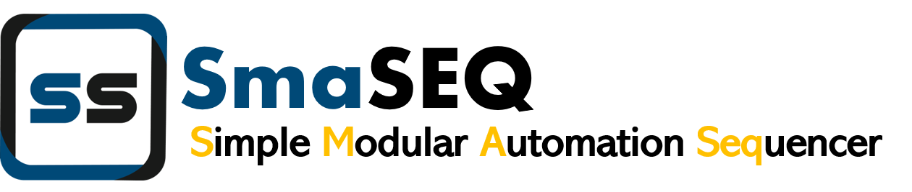
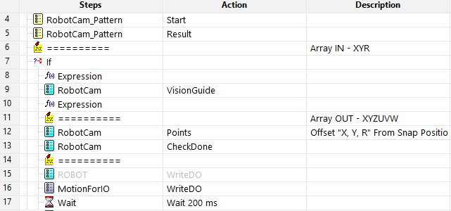

# SmaSEQ 簡介

## 一起享受簡單快速的自動化系統開發吧！

Smasoft 秉持著「自動化就是這麼簡單」的精神，致力於各種軟硬體整合，開發出一套簡單、快速與直覺的專案編輯軟體 - SmaSEQ \(Simple Modular Automation Sequencer\) 。

## 少了複雜的程式碼，自動化不再耗時費力。

SmaSEQ 提供簡易操作、彈性運用的工具介面，為機器視覺、機械手臂、運動控制......等模組制定了標準化的設置環境，使用滑鼠點擊、拖拉編排，即可完成大部分的設定。

## 來看看有哪些模組吧！

### 通訊傳輸 - SmaCOM

#### 機台資料的通訊交換橋梁。 

TCP/IP、Serial、ModbusSerial......，SmaCOM提供了常見的設備通訊機制。

### 機器視覺 - SmaVISION

#### 瑕疵檢查、尺寸量測等影像處理函式庫。

SmaVISION模組提供多樣的視覺演算功能，使用者可針對產品的外觀特徵與檢測需求，自由且快速地設計專屬的應用程序。此外，亦可搭配偲倢的 SmaAI 視覺檢測模型，以 AI 外觀瑕疵檢測。

### 機械手臂 - SmaROBOT

#### 多廠牌機械手臂，標準化操作介面。

 SmaROBOT 整合了 Epson、ABB、TM......等多種手臂，讓使用者能透過單一的介面，操作不同廠牌的機械手臂進行開發！

### 運動控制 - SmaMOTION

#### 多種運動控制卡，滿足 X Y平台需求。

SmaMotion整合了多項運動控制卡，如Kingstar、SMC6480、ZMotion......等。

### 數位訊號 - SmaDIO

#### 數位 I/O 擴充卡，提供更多的數位 I/O 訊號點。

SmaDIO 有 UniDAQ、6400 I/O 卡可供選擇，接上即可立即使用。

