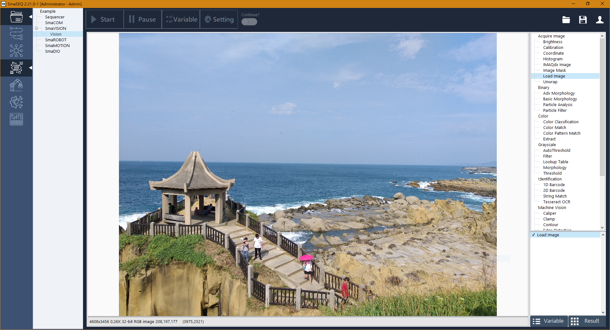
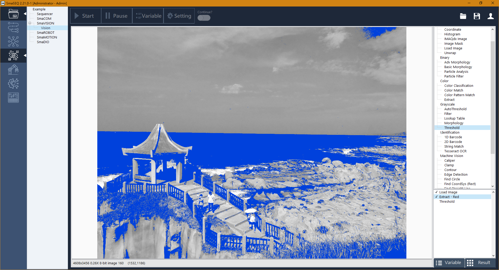

# 影像處理函式說明

### **Acquire Image （影像擷取）**

* Brightness 亮度調整
* Calibration 影像校正
* Coordinate 影像定位
* Histogram 影像灰階數值
* IMAQdx Image 拍照取像

* Image Mask 影像裁切
* Load Image 載入影像
* Unwrap 環狀展開

### **Color（彩色影像應用）**\*\*\*\*

* Color Classification 色彩分

  色彩比對

* Color Pattern Match 彩色圖案比對
* Extract 抽色

### **Grayscale（灰階影像應用）**\*\*\*\*

* Auto Threshold 自動二值化演算
* Filter 濾鏡
* Lookup Table 查找表

* Morphology 形態學演算
* Threshold 自訂二值化

### **Binary（二值影像應用）**\*\*\*\*

* Adv. Morphology 進階形態學演算
* Basic Morphology 基本型態學演算
* Particle Analysis 粒子圖塊分析
* Particle Filter 粒子圖塊過濾

### **Machine Vision（機器視覺）**

* Caliper 座標點關係運算
* Clamp 夾鉗式量測
* Contour 輪廓量測
* Edge Detection 邊緣偵測
* Find Circle 尋找圓形
* Find CoordSys \(Rect\)
* Find Straight Line
* Geometric Pattern Match
* Pattern Match
* Set Result Status
* Shape Detection

### **Identification（身分識別）**

* 1D Barcode
* 2D Barcode
* String Match
* Tesseract OCR

### **AI（人工智慧）**

* AI Inference
* Object Detection
* Segmentation

