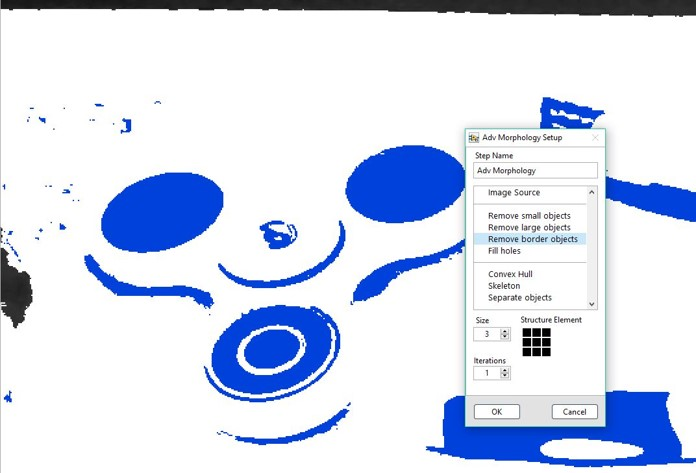

# Adv. Morphology 進階形態學演算

* 進階二值影像形態處理 
  * 去除視窗邊緣物件 
  * 孔洞填補 
  * 凸包 
  * ……

### ROI 工具:

| Line | Rectangle | Rotated Rectangle | Annulus |
| :---: | :---: | :---: | :---: |
| - | - | - | - |

