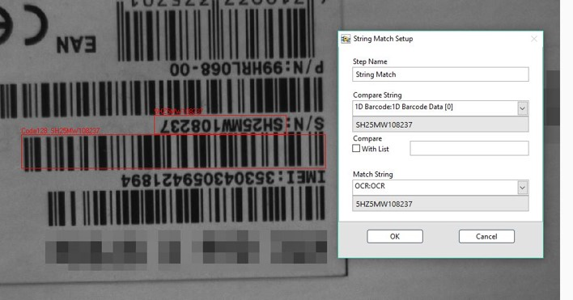
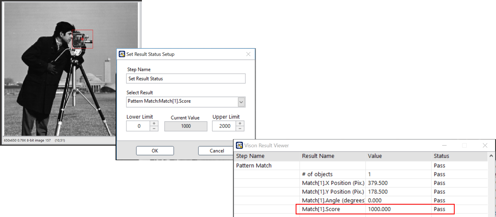

# 結果數據比對

## String Match: 字串比對

* 能夠比對不同影像處理流程完成後的文字結果，或與使用者輸入的特定字串進行比對

#### ROI 工具:

|              Line              |         Rectangle         | Rotated Rectangle |        Annulus        |
| :---: | :---: | :---: | :---: |
| - | - | - | - |

 

## Set Result Status 設定數據上下限標準

* 依照使用者設定的數值範圍，將影像處理完的結果區分為良品或不良品
* \[Pass或Fail的結果將儲存於變數 System.Status中\]

<<<<<<< HEAD
=======
#### ROI 工具:

|              Line              |         Rectangle         | Rotated Rectangle |        Annulus        |
| :---: | :---: | :---: | :---: |
| - | - | - | - |

 

>>>>>>> SmaVISION
