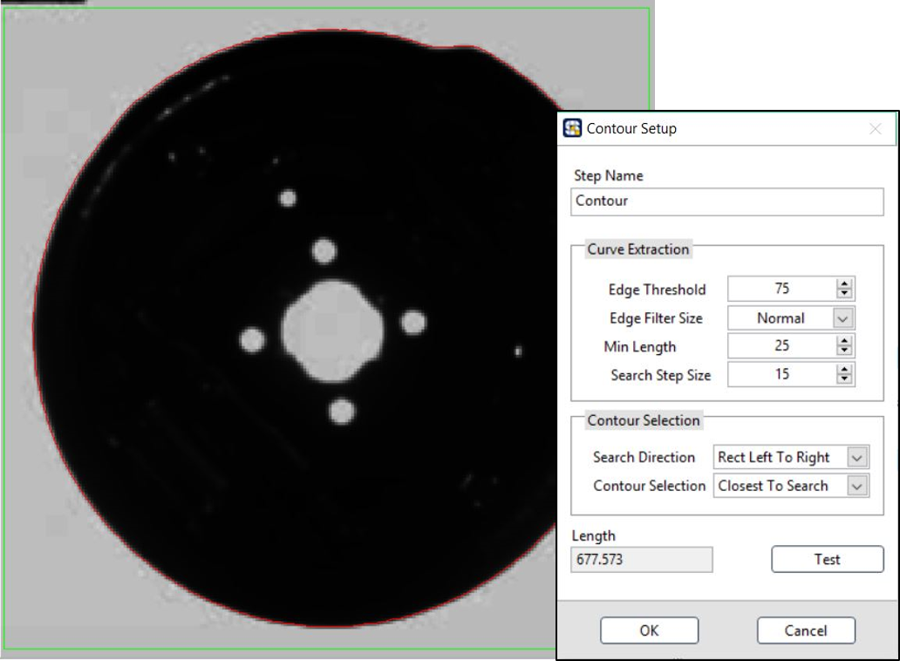

# 尺寸計算

### Contour: 輪廓量測

* Curve Extraction 偵測邊緣弧線 
* Contour Selection 輪廓搜尋模式

#### ROI 工具:

| Line | Rectangle | Rotated Rectangle | Annulus |
| :---: | :---: | :---: | :---: |
| - | 單一 | - | - |

### Clamp: 尺寸量測 \(夾鉗式\)

搜尋影像的框選區域中，位於中間軸位置有較高梯度變化的兩點間距

* Process: 選擇量測方式
* Edge Parameters 邊緣參數
  * Contrast: 對比門檻
  * Filter width: 濾鏡大小
  * Steepness: 陡峭程度
  * Step Size: 搜尋之間隙
* Distance: 輸出量測之長度
* Distance \(Real\): 當有圖像有經過校正時，會顯示 Real World 數值

#### ROI 工具:

| Line | Rectangle | Rotated Rectangle | Annulus |
| :---: | :---: | :---: | :---: |
| - | 單一 | - | - |

### Caliper: 座標關係計算

* Available Points: 可選用座標點
* Geometric Feature: 計算功能
  * Distance: 兩點之距離
  * Mid Point: 兩點之中點座標
  * Perpendicular Projection: 點到線之投影座標與距離
  * Line Intersection: 兩線之交點座標
  * Angle from Horizontal: 線與水平線之夾角
  * Angle from Vertical: 線與垂直線之夾角
  * Angle Defined by 3 Points: 三點所成之角度
  * Angle Defined by 4 Points: 四點所成之角度
  * Bisecting Line: 兩線之中線
  * Mid Line: 點與線之中線
  * Center of Mass:質量中心
  * Area: 多點所成之面積
  * Line Fit: 多點所成之最佳直線
  * Circle Fit: 多點所成之圓
  * Ellipse Fit: 多點所成之橢圓

#### ROI 工具:

| Line | Rectangle | Rotated Rectangle | Annulus |
| :---: | :---: | :---: | :---: |
| - | - | - | - |

