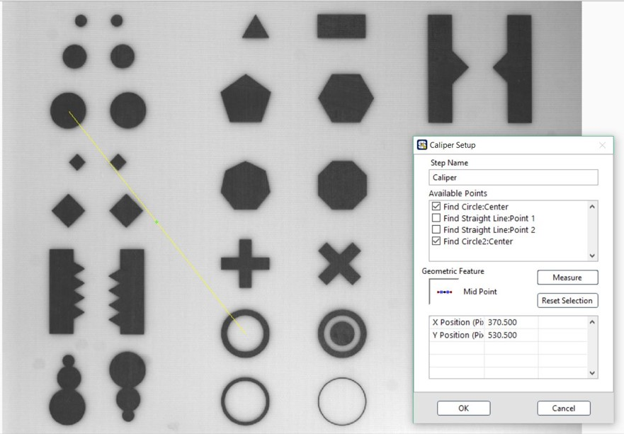

# Caliper 座標點關係運算

* Available Points: 可選用座標點
* Geometric Feature: 計算功能
  * Distance: 兩點之距離
  * Mid Point: 兩點之中點座標
  * Perpendicular Projection: 點到線之投影座標與距離
  * Line Intersection: 兩線之交點座標
  * Angle from Horizontal: 線與水平線之夾角
  * Angle from Vertical: 線與垂直線之夾角
  * Angle Defined by 3 Points: 三點所成之角度
  * Angle Defined by 4 Points: 四點所成之角度
  * Bisecting Line: 兩線之中線
  * Mid Line: 點與線之中線
  * Center of Mass:質量中心
  * Area: 多點所成之面積
  * Line Fit: 多點所成之最佳直線
  * Circle Fit: 多點所成之圓
  * Ellipse Fit: 多點所成之橢圓

