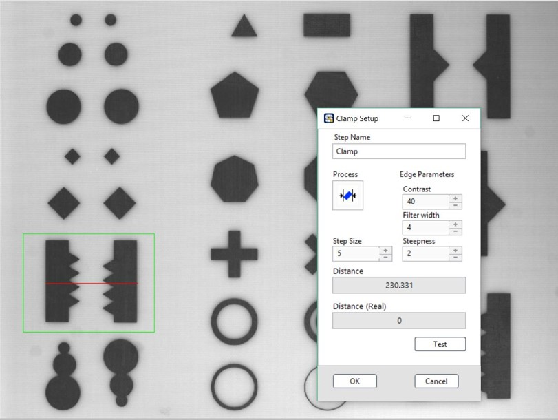

# Clamp 夾鉗式量測

### 適用影像格式

| 彩色 | 灰階 | 二值 |
| :---: | :---: | :---: |
| X | O | X |

### ROI 框選方式

<table>
  <thead>
    <tr>
      <th style="text-align:center">Line
         &#x76F4;&#x7DDA;</th>
      <th style="text-align:center">Rectangle
         &#x65B9;&#x5F62;</th>
      <th style="text-align:center">
        
Rotated Rectangle

        
&#x53EF;&#x65CB;&#x8F49;&#x65B9;&#x5F62;

      </th>
      <th style="text-align:center">
        
Annulus

        
&#x540C;&#x5FC3;&#x5713;

      </th>
    </tr>
  </thead>
  <tbody>
    <tr>
      <td style="text-align:center">X</td>
      <td style="text-align:center">O</td>
      <td style="text-align:center">O</td>
      <td style="text-align:center">X</td>
    </tr>
  </tbody>
</table>

搜尋影像的框選區域中，位於中間軸位置有較高梯度變化的兩點間距

* Process: 選擇量測方式
* Edge Parameters 邊緣參數
  * Contrast: 對比門檻
  * Filter width: 濾鏡大小
  * Steepness: 陡峭程度
  * Step Size: 搜尋之間隙
* Distance: 輸出量測之長度
* Distance \(Real\): 當有圖像有經過校正時，會顯示 Real World 數值

