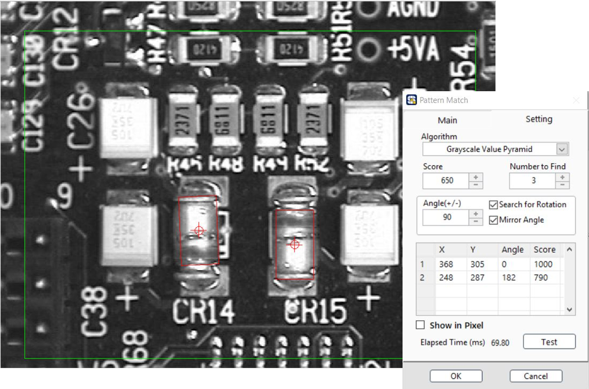

# Pattern Match 圖樣比對

### 建立樣本\( Template \)

1. 新增 / 載入 / 編輯
2. 框選樣本圖案
3. 設定座標中心點

### 設定搜尋參數

* Algorithm: 演算法\(快速→嚴謹\)
  * 通常使用 Low Discrepancy Sampling 即可，偶會使用 Grayscale Value Pyramid
* Score: 分數門檻 
  * 僅顯示達到此門檻之結果
* Number to Find: 搜尋數量
  * 每個 ROI 中，要搜尋多少圖案。
* Search for Rotation: 搜尋旋轉圖案 
* Angle: 欲搜尋圖案之旋轉角度範圍 \(+/-\) 
* Mirror Angle: 鏡像角度

### ROI 工具:

| Line | Rectangle | Rotated Rectangle | Annulus |
| :---: | :---: | :---: | :---: |
| - | 單一 / 多個 | 單一 / 多個 | - |

