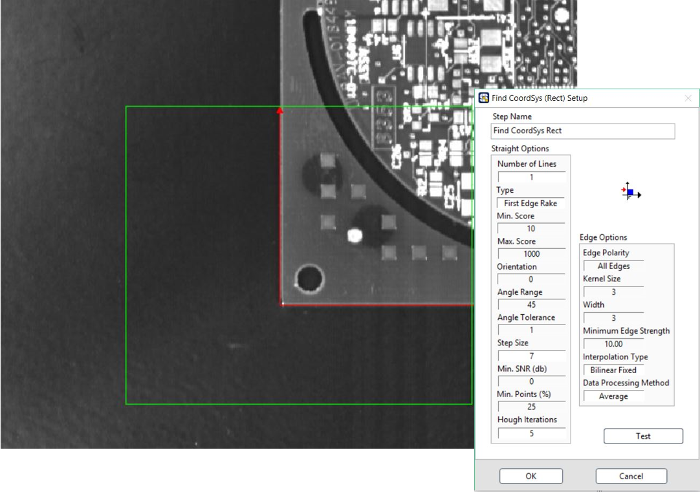

# ROI定位

## 

## FindCoordSys \(Rect\): 搜尋兩相互垂直線並定義 ROI 座標點

* 自動搜尋影像框選區域中的直角並設為參考坐標，右上角選擇搜尋直線方向

### ROI 工具:

| Line | Rectangle | Rotated Rectangle | Annulus |
| :---: | :---: | :---: | :---: |
| - | 單一 | - | - |

