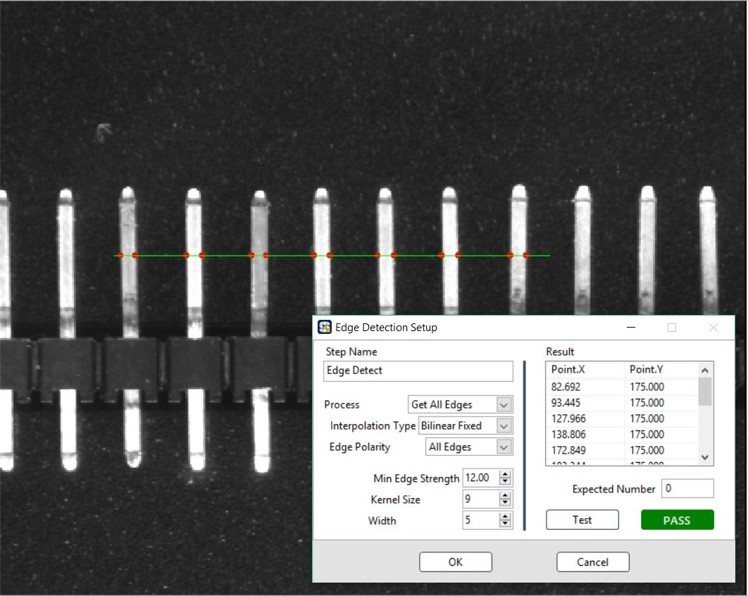
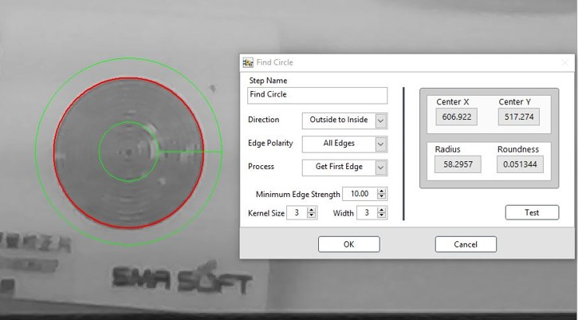
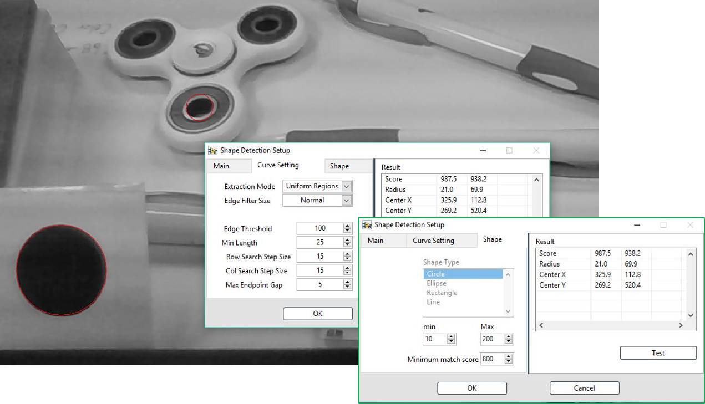
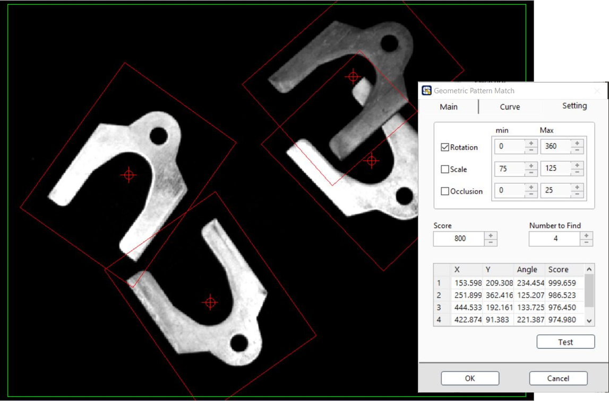
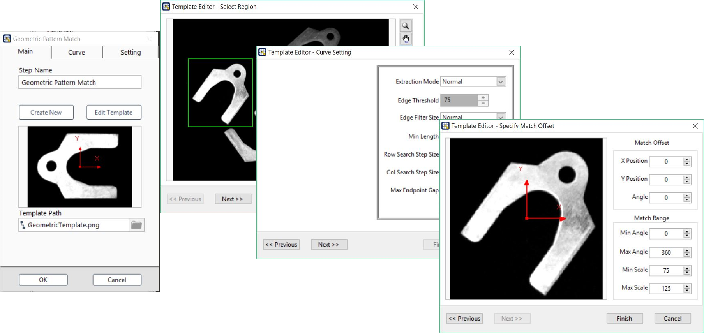

# 灰階影像

Edge Detection: 邊緣偵測

* Process: 搜尋目標種類 
* ……
* Expected Number 預期數量

Find Straight Line 找直線

* 搜尋框選的影像區域中的直線， 並回傳該直線起始點與終點的像素座標值

Find Circle: 找圓

* 在框選的影像區域中，搜尋圓形輪廓的目標，並輸出該圓形的圓心像素座標、半徑與真圓度

Shape Detection: 形狀偵測

* 搜尋影像中的基本幾何圖案

Pattern Match: 圖像比對

* Algorithm: 演算法\(快速→嚴謹\)
* Score: 分數門檻 
* Number to Find: 搜尋數量
* Search for Rotation: 搜尋旋轉圖案 
* Angle: 角度範圍 \(+/-\) 
* Mirror Angle: 鏡像角度

Geometric Pattern Match: 幾何圖像比對

* 建立Template
* 依照建立的模板輪廓，在框選的影像區域中搜尋輪廓相近的目標

