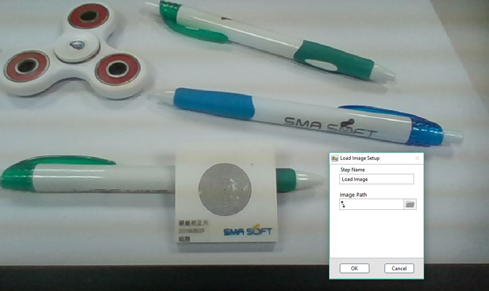
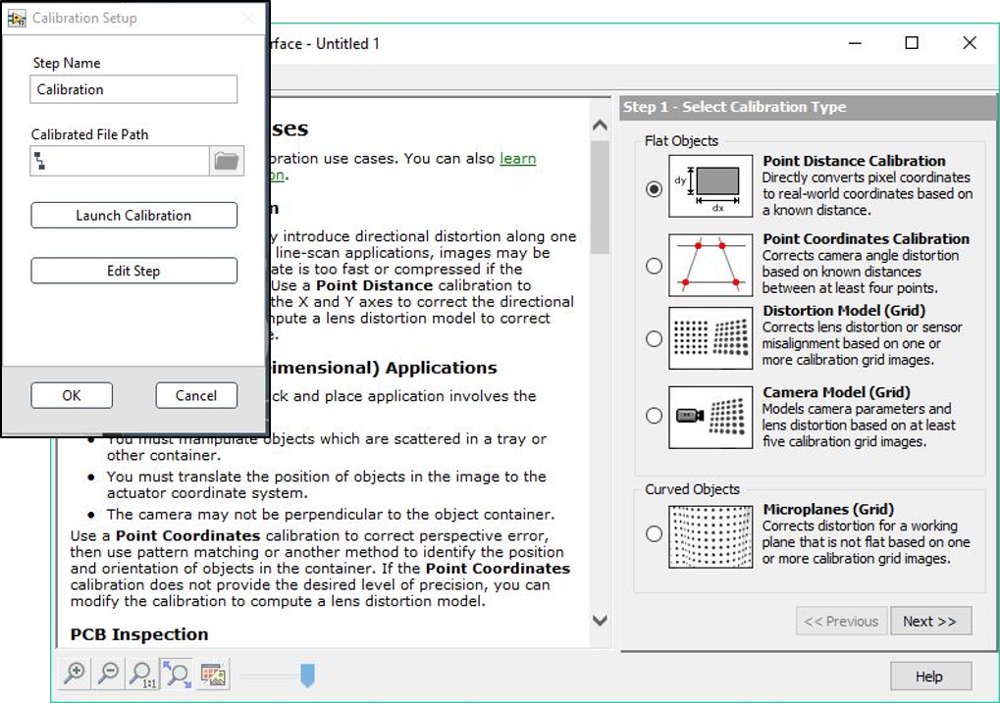

# 取像與校正

IMAQdx Image ; Load Image

* IMAQdx Image: 取像 
* Load Image: 載圖

Calibration: 影像校正、Scale計算、座標換算

* Launch Calibration: 啟動校正應用程式 
  * 程式路徑: “C:\Program Files \(x86\)\National Instruments\Vision \Utility\Calibration Training Interface \NI Calibration Training.exe“ 
* Edit Step: 可手動編輯Scale

