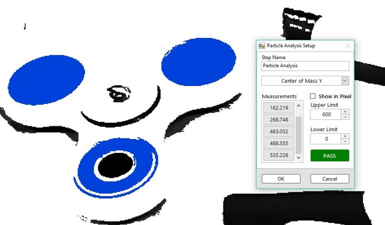

# 二值影像分析

## 二值影像分析

### Particle Analysis: 粒子分析\(含Judgment\)

* 二值影像數值分析與判斷設定 
  * 座標、面積、轉動慣量……

&lt;&lt;&lt;&lt;&lt;&lt;&lt; HEAD

## &lt;&lt;&lt;&lt;&lt;&lt;&lt; HEAD

#### ROI 工具:

=======

### ROI 工具:

> > > > > > > 1c9e3559cb27f2f92443627fc7d98f3e59876b75

| Line | Rectangle | Rotated Rectangle | Annulus |
| :---: | :---: | :---: | :---: |
| - | - | - |  |

&lt;&lt;&lt;&lt;&lt;&lt;&lt; HEAD

> > > > > > > SmaVISION

=======

> > > > > > > 1c9e3559cb27f2f92443627fc7d98f3e59876b75

