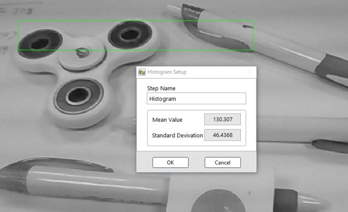

# 灰階影像分析

## 灰階影像分析

### Histogram: 灰階直方圖

* Mean Value: 灰階分布平均值
* Standard Deviation: 標準差 
  * 灰階值越分散越大

<<<<<<< HEAD
## &lt;&lt;&lt;&lt;&lt;&lt;&lt; HEAD

#### ROI 工具:
=======
### ROI 工具:
>>>>>>> 1c9e3559cb27f2f92443627fc7d98f3e59876b75

| Line | Rectangle | Rotated Rectangle | Annulus |
| :---: | :---: | :---: | :---: |
| - | 單一 | - | - |

<<<<<<< HEAD
> > > > > > > SmaVISION

=======
>>>>>>> 1c9e3559cb27f2f92443627fc7d98f3e59876b75
