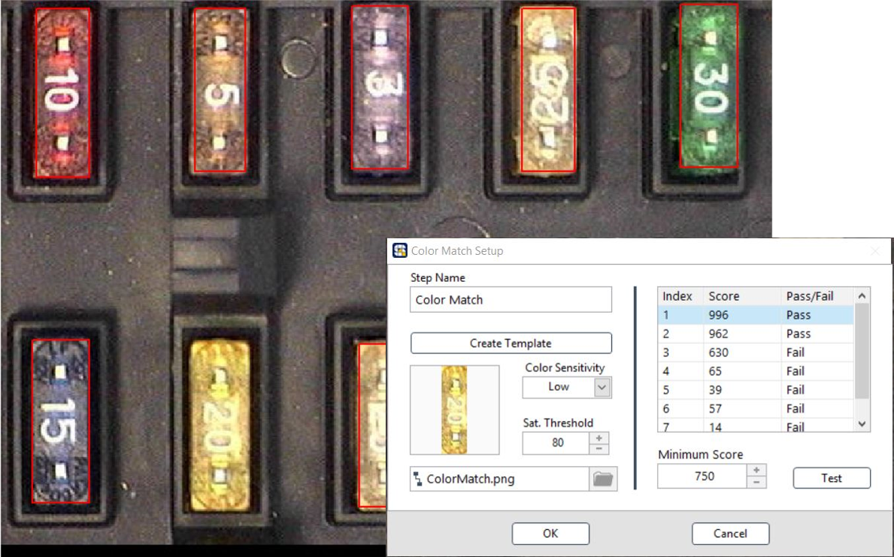
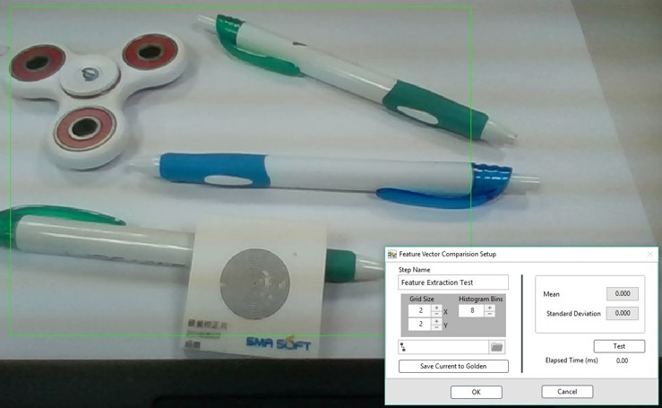
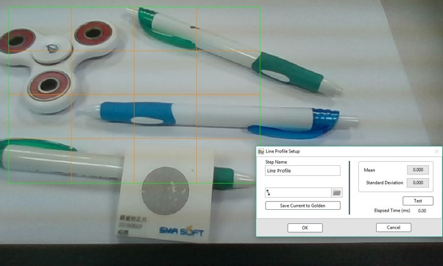

# 色彩分析

Color Classification: 色彩定義

* Path: 載入資訊檔\(.clf\)
* Target: 目標名稱
* Identity Score: 分數門檻

Color Match 色彩比對

* Create Template: 創建比對樣本
* Color Sensitivity: 顏色解析精細度
* Minimum Score: 分數門檻

Feature Vector: 特徵向量比對

* Grid Size: 分割數量
* Histogram Bins: 特徵向量解析支束
* Save Current to Golden: 儲存ROI內，圖像之特徵向量

Line Profile

* Save Current to Golden: 儲存ROI內所劃出的 3\*3 Line Profile

