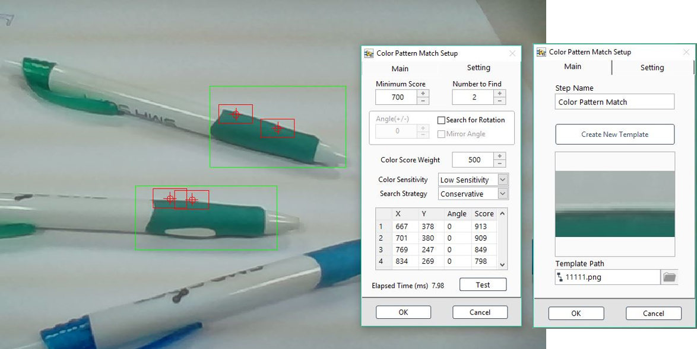

# Color Pattern Match 彩色圖案比對

* Create Template: 創建比對樣本
* Minimum Score: 分數門檻
* Numbers to Find: ROI內搜尋數量
* Search for Rotation: 搜尋旋轉圖案 
* Angle: 角度範圍 \(+/-\) 
* Mirror Angle: 鏡像角度
* Color Score Weight: 顏色比重
* Color Sensitivity: 顏色解析精細度 
* Search Strategy: 搜尋嚴謹程度

### ROI 工具:

| Line | Rectangle | Rotated Rectangle | Annulus |
| :---: | :---: | :---: | :---: |
| - | 單一 / 多個 | - | - |

