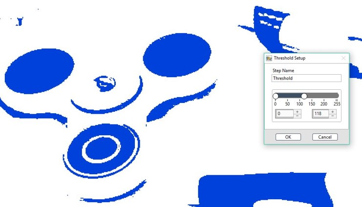
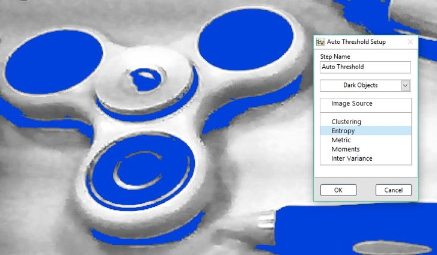

# 灰階影像二值化

## 灰階影像二值化

### Threshold: 二值化門檻

* 灰階影像二值化

### ROI 工具:

| Line | Rectangle | Rotated Rectangle | Annulus |
| :---: | :---: | :---: | :---: |
| - | - | - | - |

<<<<<<< HEAD
### Auto Threshold: 自動二值化
=======
## Auto Threshold: 自動二值化
>>>>>>> 1c9e3559cb27f2f92443627fc7d98f3e59876b75

* 灰階影像二值化 \(自動演算\)

<<<<<<< HEAD
## &lt;&lt;&lt;&lt;&lt;&lt;&lt; HEAD

#### ROI 工具:
=======
### ROI 工具:
>>>>>>> 1c9e3559cb27f2f92443627fc7d98f3e59876b75

| Line | Rectangle | Rotated Rectangle | Annulus |
| :---: | :---: | :---: | :---: |
| - | - | - | - |

<<<<<<< HEAD
> > > > > > > SmaVISION

=======
>>>>>>> 1c9e3559cb27f2f92443627fc7d98f3e59876b75
