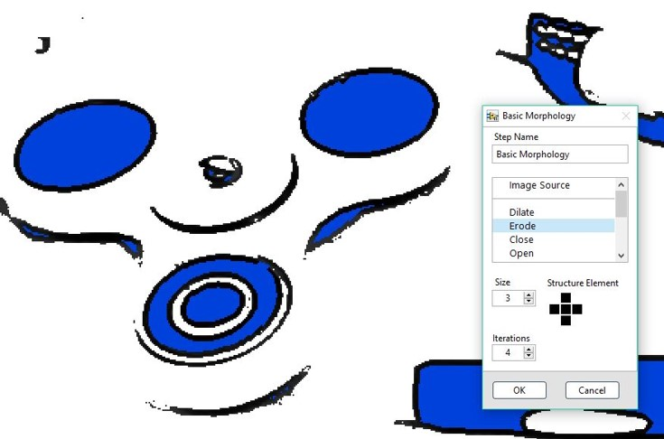
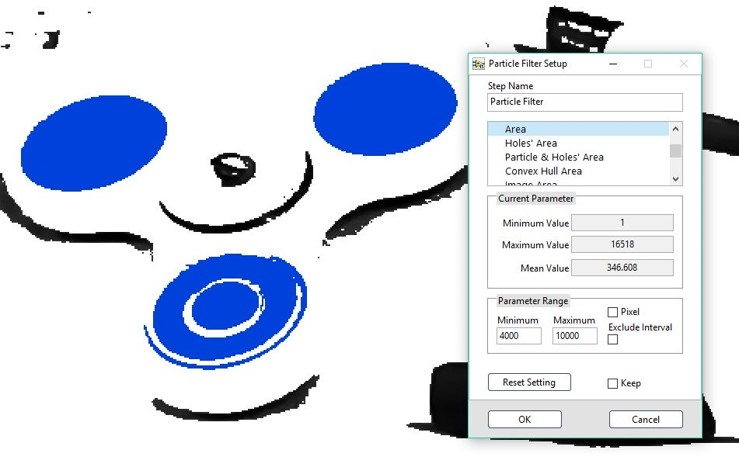

# 二值影像

## 二值影像

### Basic Morphology: 二值影像形態學

* 二值影像形態處理 
  * 膨脹、侵蝕、結合、分割……

&lt;&lt;&lt;&lt;&lt;&lt;&lt; HEAD

#### ROI 工具:   

=======

### ROI 工具:   

> > > > > > > 1c9e3559cb27f2f92443627fc7d98f3e59876b75

| Line | Rectangle | Rotated Rectangle | Annulus |
| :--- | :--- | :--- | :--- |
| - | - | - | - |

&lt;&lt;&lt;&lt;&lt;&lt;&lt; HEAD

### Adv. Morphology: 進階形態學

=======

## Adv. Morphology: 進階形態學

> > > > > > > 1c9e3559cb27f2f92443627fc7d98f3e59876b75

* 進階二值影像形態處理 
  * 去除視窗邊緣物件 
  * 孔洞填補 
  * 凸包 
  * ……

### ROI 工具:

| Line | Rectangle | Rotated Rectangle | Annulus |
| :---: | :---: | :---: | :---: |
| - | - | - | - |

&lt;&lt;&lt;&lt;&lt;&lt;&lt; HEAD

### Particle Filter: 粒子過濾

=======

## Particle Filter: 粒子過濾

> > > > > > > 1c9e3559cb27f2f92443627fc7d98f3e59876b75

* 二值影像過濾門檻 
  * 座標、面積、轉動慣量……

&lt;&lt;&lt;&lt;&lt;&lt;&lt; HEAD

## &lt;&lt;&lt;&lt;&lt;&lt;&lt; HEAD

#### ROI 工具:

=======

### ROI 工具:

> > > > > > > 1c9e3559cb27f2f92443627fc7d98f3e59876b75

| Line | Rectangle | Rotated Rectangle | Annulus |
| :---: | :---: | :---: | :---: |
| - | - | - | - |

&lt;&lt;&lt;&lt;&lt;&lt;&lt; HEAD

> > > > > > > SmaVISION

=======

> > > > > > > 1c9e3559cb27f2f92443627fc7d98f3e59876b75

