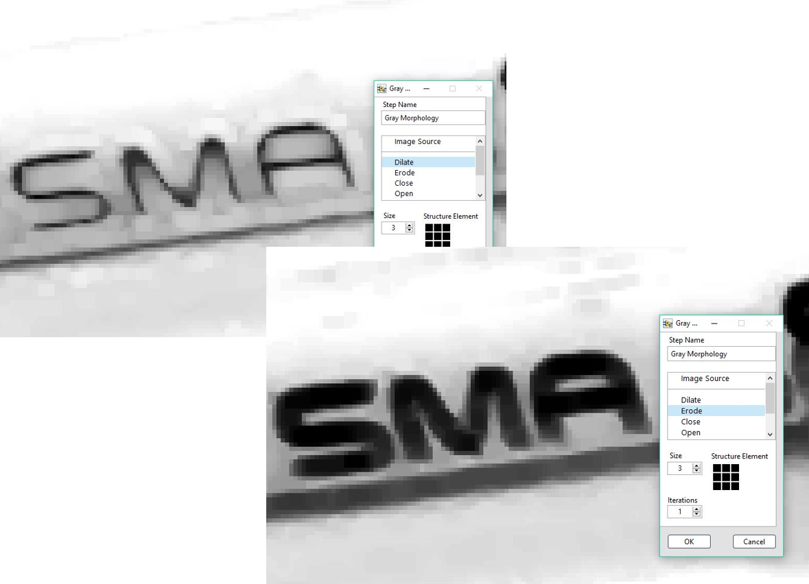
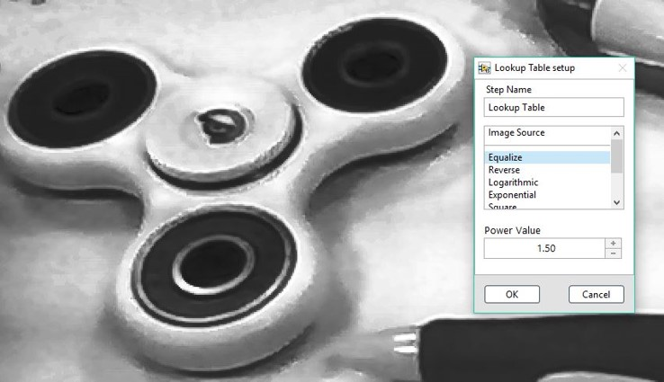

# 灰階影像

## 灰階影像

### Morphology: 形態學\(灰階\)

* Dilate: 膨脹 
* Erode: 侵蝕 
* Close: 先膨脹後侵蝕 
* Open: 先侵蝕後膨脹 
* ……
* Size: 處理的Kernel Size 
* Structure Element: Kernel的形狀
* Iteration: 疊代層數

### ROI 工具:

| Line | Rectangle | Rotated Rectangle | Annulus |
| :---: | :---: | :---: | :---: |
| - | - | - | - |

&lt;&lt;&lt;&lt;&lt;&lt;&lt; HEAD

### Lookup Table: 查找表

=======

## Lookup Table: 查找表

> > > > > > > 1c9e3559cb27f2f92443627fc7d98f3e59876b75

* Equalize: 灰階圖像重建至0~255 
* ……
* Power Value: 強度

&lt;&lt;&lt;&lt;&lt;&lt;&lt; HEAD

#### ROI 工具:

=======

### ROI 工具:

> > > > > > > 1c9e3559cb27f2f92443627fc7d98f3e59876b75

| Line | Rectangle | Rotated Rectangle | Annulus |
| :---: | :---: | :---: | :---: |
| - | - | - | - |

&lt;&lt;&lt;&lt;&lt;&lt;&lt; HEAD

### Filter: 濾鏡

=======

## Filter: 濾鏡

> > > > > > > 1c9e3559cb27f2f92443627fc7d98f3e59876b75

* Smoothing: 灰階圖像平滑處理 
* ……

&lt;&lt;&lt;&lt;&lt;&lt;&lt; HEAD

## &lt;&lt;&lt;&lt;&lt;&lt;&lt; HEAD

#### ROI 工具:

=======

### ROI 工具:

> > > > > > > 1c9e3559cb27f2f92443627fc7d98f3e59876b75

| Line | Rectangle | Rotated Rectangle | Annulus |
| :---: | :---: | :---: | :---: |
| - | - | - | - |

&lt;&lt;&lt;&lt;&lt;&lt;&lt; HEAD

> > > > > > > SmaVISION

=======

> > > > > > > 1c9e3559cb27f2f92443627fc7d98f3e59876b75

