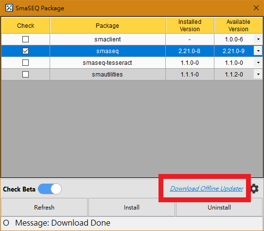
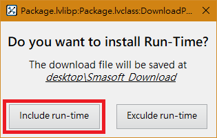
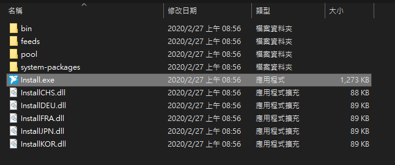
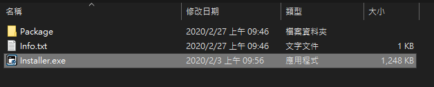

# 離線安裝

#### 若要在無法連接網際網路的電腦上安裝或更新 SmaSEQ，可使用一台可上網的電腦下載離線安裝檔，移至無法連網的電腦上進行安裝。

## 準備一台可上網的電腦

### 1. 在此電腦上安裝 SmaUtilities

#### 下載與安裝 SmaUtilities 的方式請詳見[線上安裝](https://app.gitbook.com/@smasoft-support/s/dev-manual/~/drafts/-M14KAHXvE1kxJjm_x6n/jing-pei-zhi/an/xian-shang-an-zhuang)。

### 2. 使用 SmaUtilities 下載離線安裝檔

開啟 SmaUtilities 的 Package 功能

#### Include Run-Time

若在全新電腦上安裝 SmaSEQ ，請選擇 Include run-time

#### Exclude Run-Time

在已有舊版 SmaSEQ 上更新，請選擇 Exclude run-time

## 在不能上網的電腦上進行安裝

### 1. 安裝 SmaUtilities

### 2. 安裝 SmaSEQ

