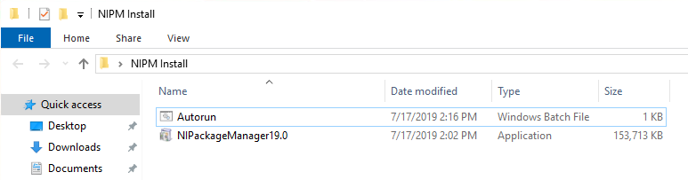
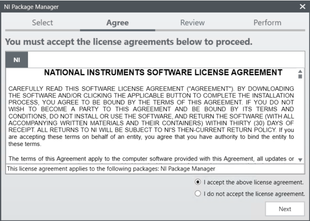
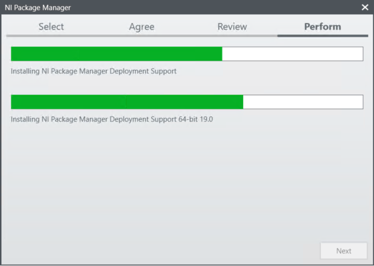
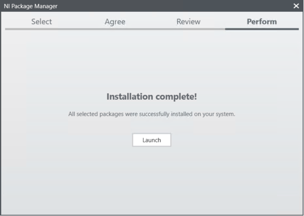
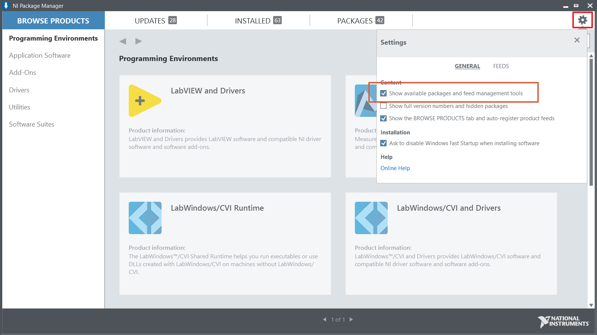
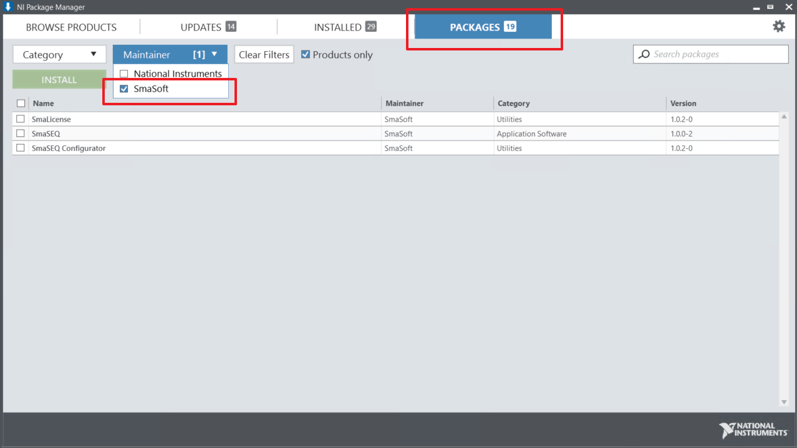
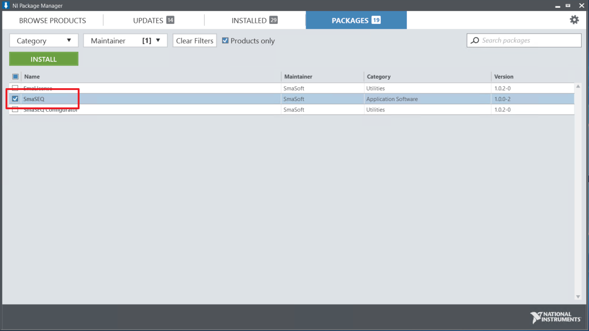
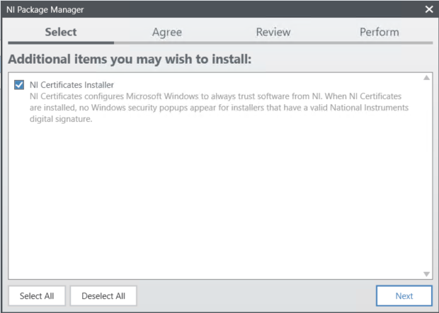
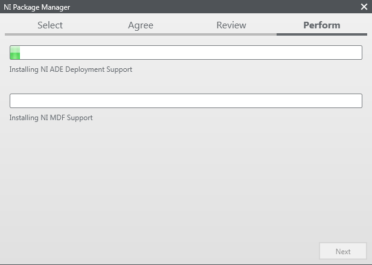
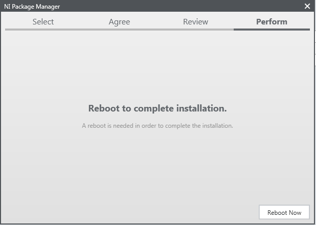

# 線上安裝

SmaSEQ透過NI Package Manager\(NIPM\)來安裝及更新，請先[下載NIPM](https://smasoft.sharepoint.com/:u:/s/Smasoft_Download73/ET8Vxpf0zdlJlRVu_s06D9YBPmZzjLjfKxd2O6CW19cIOg?download=1)再進行後續安裝步驟。

1. 執行下載安裝檔內的Auotorun.bat，會開始安裝NIPM

1. 點選同意授權條件並點Next繼續安裝  

1. 安裝過程約5分鐘  

1. 安裝完成點Launch啟動NIPM  

1. 點擊NIPM右上角的齒輪，並勾選Show available packages and feed management tools 

1. 切換到PACKAGES頁籤，並在Maintainer中勾選SmaSoft 

1. 勾選SmaSEQ點擊Install

1. 點擊Next繼續安裝 

1. 安裝過程約10~15分鐘並需要網路連接，請確保網路穩定  

1. 安裝完成，請關閉使用者登入及授權視窗，並重新開機

