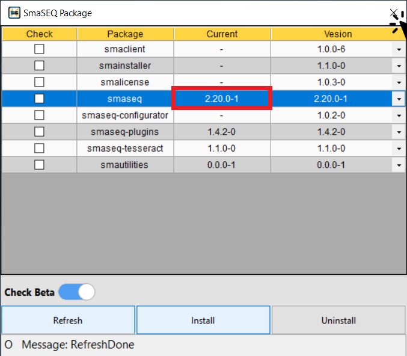

# 線上安裝

#### SmaSEQ 的安裝是透過 SmaUtilities 管理，請先[下載 SmaUtilities ](https://smasoft.sharepoint.com/:u:/s/Smasoft_Download73/EQaOnTzdFT5BgG9F4R51IC0BjU8MlI9Gk5ZlGVoRIGC0BA?e=9q7jmF)並安裝。

## 安裝 SmaUtilities

#### 1. 解壓縮 SmaUtilities Installer，開啟「SmaUtilities Installer」資料夾，點擊 `Install.exe`

#### 2. 同意授權條件，並點「Next」繼續安裝  

#### 3. 等待第一階段安裝，歷時約 3分鐘  

#### 4. 第一階段安裝完成後，會自動引導至第二階段。點擊「Next」開始第二階段安裝，歷時約數秒  

#### 5. 第二階段安裝完成後，點擊「Close」關閉視窗，並重新開機。 

## 安裝 SmaSEQ

#### 1. 開機後 SmaUtilities 會自動執行，可以在工作列的隱藏圖示找到 SmaUtilities。 執行 SmaUtilities 時，Windows 防火牆可能會跳出通知，請允許 SmaUtilities 通過防火牆。

#### 2. 右鍵點擊 SmaSEQ Utilities 圖示，開啟 SmaUtilities 選單。選擇 Package 功能，挑選 SmaSEQ 版本後，按下 Install 開始安裝。

#### 3. SmaSEQ 安裝過程會引導安裝其他需要的元素，請依序逐一安裝，直到 SmaSEQ 安裝完成，依照網速約 3~15 分鐘完成。

#### 4. 確認安裝完成後，即可關閉視窗，進行《軟體授權》


如需軟體授權，請參閱《軟體授權》


