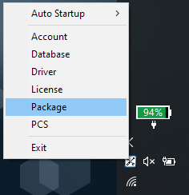
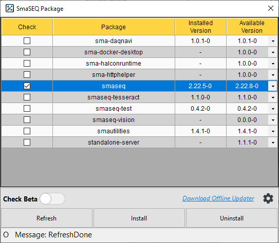
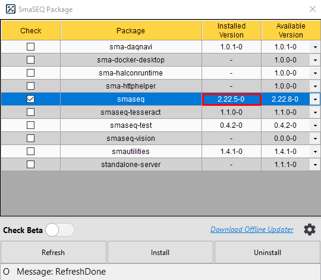

# 線上安裝

#### SmaSEQ是透過SmaUtilities安裝，請下載並安裝最新的 [SmaUtilities](https://gitlab.com/SmaSoftTW/smautilities-release/-/releases)，詳見[SmaUtilities User Manual](https://smasoft-support.gitbook.io/manual-smautilities/smautilities)。

## 安裝 SmaSEQ

#### 1. 開機後 SmaUtilities 會自動執行，可以在工作列的隱藏圖示找到 SmaUtilities。 執行 SmaUtilities 時，Windows 防火牆可能會跳出通知，請允許 SmaUtilities 通過防火牆。

#### 2. 右鍵點擊 SmaSEQ Utilities 圖示，開啟 SmaUtilities 選單。選擇 Package 功能，挑選 SmaSEQ 版本後，按下 Install 開始安裝。

#### 3. SmaSEQ 安裝過程會引導安裝其他需要的元素，請依序逐一安裝，直到 SmaSEQ 安裝完成，依照網速約 3~15 分鐘完成。

#### 4. 確認安裝完成後，即可關閉視窗並重新啟動電腦。

## 進行《軟體授權》


有關軟體授權，請參閱《軟體授權》章節


