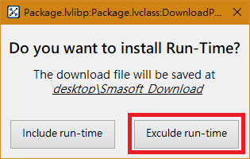

# 離線更新

#### 若要在無法連接網際網路的電腦上安裝或更新 SmaSEQ，可使用一台可上網的電腦下載離線安裝檔，移至無法連網的電腦上進行安裝。

## 開啟 SmaUtilities 的 Package 功能

### 選擇要更新的版本，按下 Download Offline Updater

#### 選擇 Exclude Run-Time

在已有舊版 SmaSEQ 上更新，請選擇 Exclude run-time

## 在不能上網的電腦上進行安裝

### 安裝 SmaSEQ 更新檔

