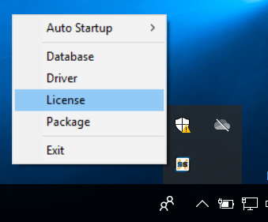
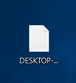
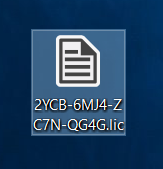
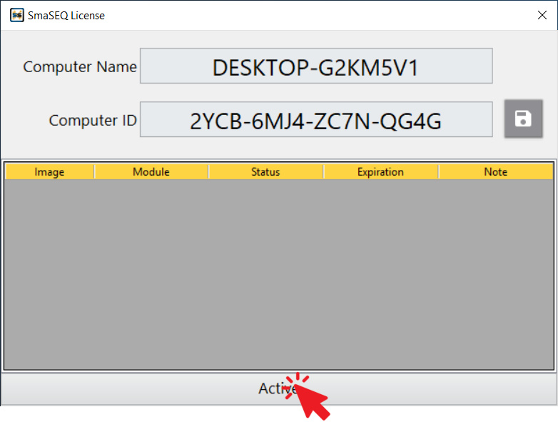
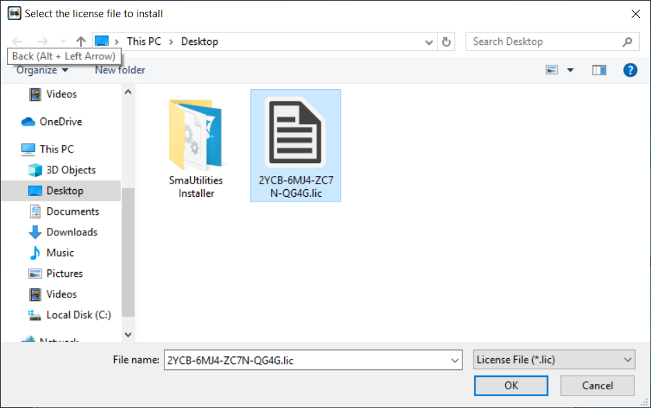
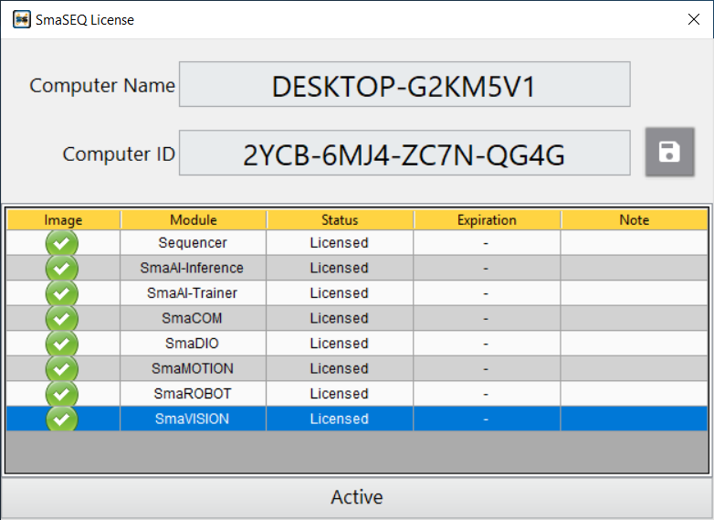
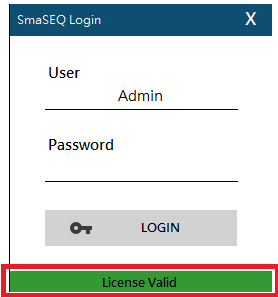

# 軟體授權

#### SmaUtilities 的 Licence 工具，負責軟體授權的驗證與管理。

## 獲取電腦機碼

#### 1. 右鍵點擊工作列上隱藏的 SmaUtilities 圖示，選擇 License 功能，開啟設定視窗。

#### 2. 點擊右側存檔圖示，儲存電腦機碼成文字檔（.txt）

#### 3. 將機碼寄給負責的業務窗口，並請告知貴單位名稱、附上訂購憑據。

## 啟用授權

#### 1. 偲倢人員回覆信件時，會附上產品授權金鑰，請使用此金鑰進行開通。（註：依照訂購合約內容，啟用的 SmaSEQ 模組可能有所不同）

#### 2. 在 SmaUtilities 的 License 功能中，點擊 Activate ，載入金鑰進行軟體授權

#### 3. SmaSEQ 軟體授權成功後，即可關閉 License 視窗

#### 4. 開始使用 SmaSEQ 

