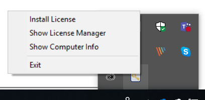
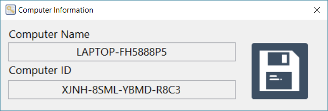
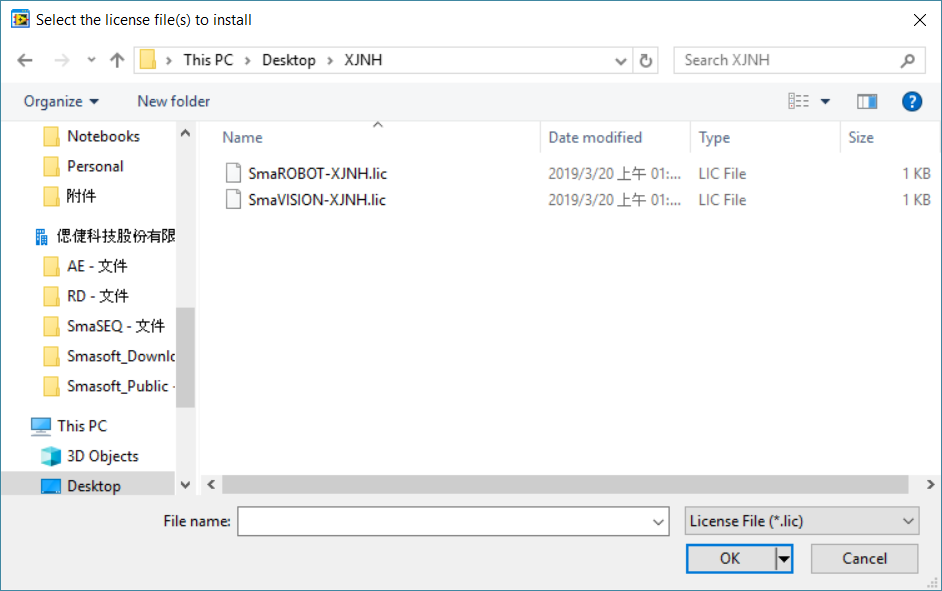

# 軟體授權

## SmaLICENSE

SmaSEQ 授權是透過 SmaLICENSE 運作，SmaLICENSE 在開機後會自動啟動，並顯示在右下角工具列。

## 如何啟用授權？

### 取得電腦機碼檔

1. 找到右下角工作列的 SmaLicense，點擊右鍵開啟選單。
2. 選擇 "Show Computer Info"，開啟電腦機碼視窗。
3. 點擊視窗右邊的存檔按鈕，將檔案存成文字檔\(.txt\)。

   

### 將機碼提供給偲倢的授權人員

1. 將機碼檔提供給偲倢的授權人員，換取授權檔
   1. 將步驟上步驟取得的機碼文字檔傳送給授權人員 \(license@smasoft.com.tw\)。
   2. 授權人員會回傳授權檔 \(各模組有各自的授權檔\)。

### 安裝授權檔

1. 右鍵點擊工作列的 SmaLicense，開啟選單。
2. 選擇 "Install License"，點選要安裝的授權\(.lic\)，可選擇一個或多個。

   

3. 安裝成功時，系統會跳出通知，點擊通知會開啟授權狀態視窗

   

4. SmaSEQ 軟體授權完成

