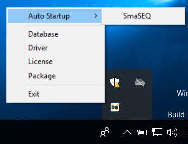
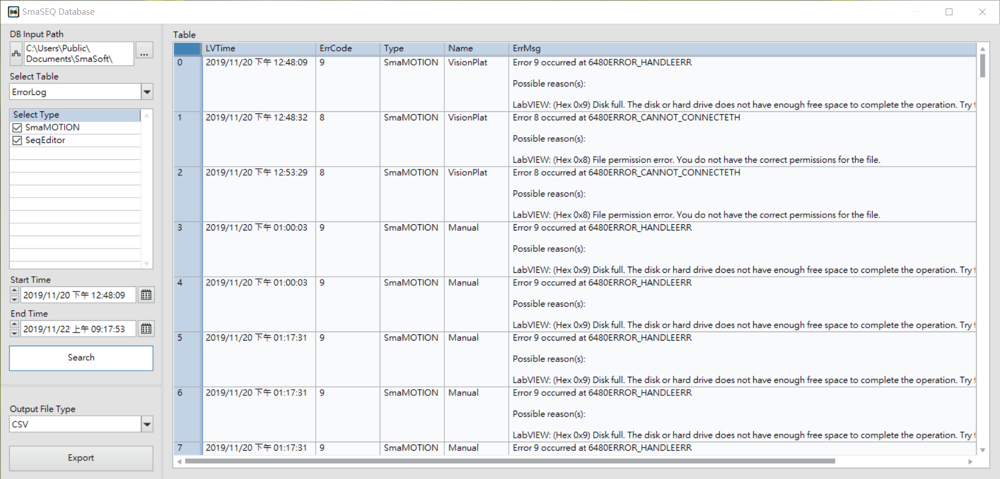
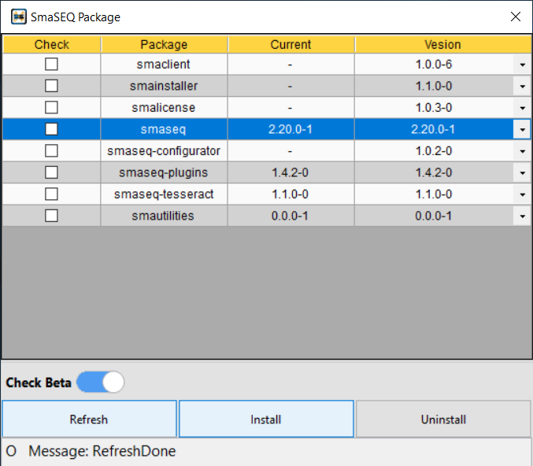

# SmaUtilities

#### SmaUtilities 負責 SmaSEQ 的軟體授權、安裝、更新等功能。在開始使用偲倢科技（Smasoft）的相關軟體產品時，請先安裝 SmaUtilities。

### SmaUtilities 功能

* **Auto Startup**

  * 可指定軟體在開機時自動啟動

* **Database**
  * 可調閱 SmaSEQ 的歷史錯誤紀錄（Error Log）與流程動作（Event）

* **Driver**
  * 可根據硬體配置選擇相對應的驅動程式

* **License**
  * 管理 Smasoft 相關軟體的授權（SmaSEQ, SmaAI）。在 SmaUtilities 運行時，SmaSEQ 才能驗證授權有效性。

* **Package**
  * 管理軟體的安裝與更新

