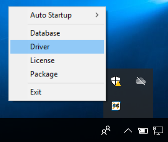
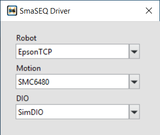

# 硬體與驅動程式

#### SmaSEQ 有多種型號的驅動程式可供選擇，請根據機台的配置型號，選擇相對應的驅動程式。

## 驅動程式管理

#### 在工作列的隱藏圖示中，右鍵點擊 SmaUtilities 開啟選單，選擇「Driver」驅動程式管理器。

#### 根據硬體選擇相對應的驅動程式

* **機械手臂**
  * EpsonTCP
  * ABBTCP
  * DensoAPI
  * TM
* **運動控制卡**
  * DMC2410C
  * KINSTAR
  * SMC6480
  * ZMotion
  * SimMotion（馬達模擬器）
* **數位訊號卡**
  * 6400
  * UniDAQ
  * SimDIO（數位訊號模擬器）

