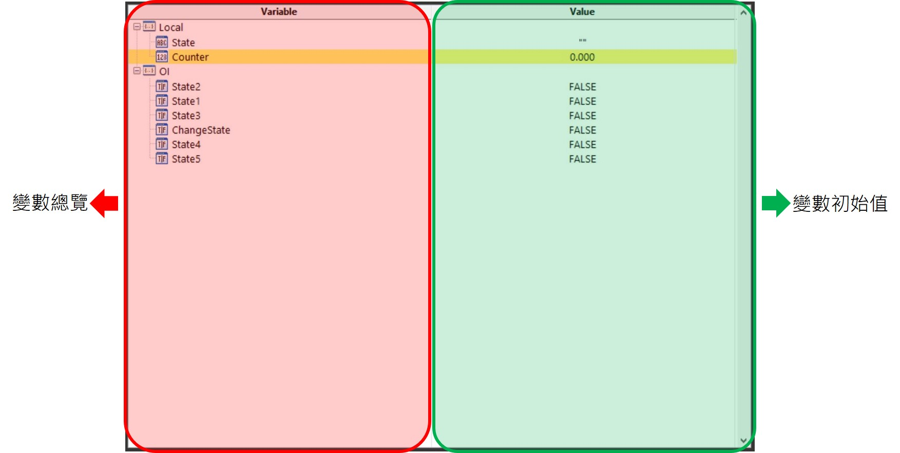
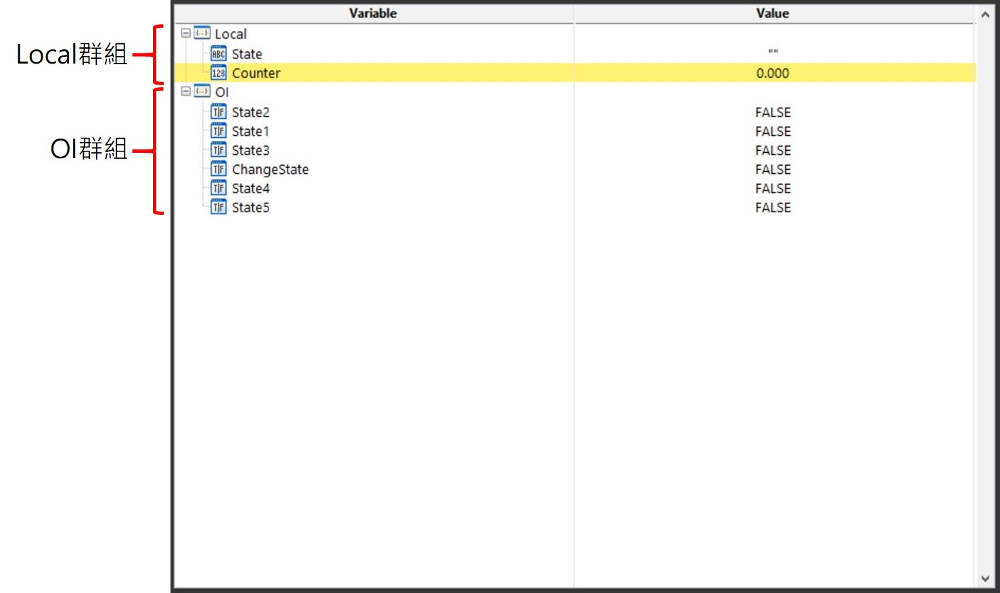

# 基本功能

## \# 變數表介面

首先，在開啟變數表後可以看到變數表分為兩個部分，左側為變數的名稱與總覽，右邊則是各個變數的初始值。

## \# 變數群組\(Local\)

每個專案都具有系統自動建立的兩個變數群組，分別為Local以及OI，其中創立在Local群組裡面的變數是線程運作中所用到的變數，而OI群組中的變數則是對應到操作員介面上的各項控件。

* **Local 群組 :** 線程中用到的變數。
* **OI 群組 :** 代表操作員介面上的控件的變數。

## \# 變數的新增、重新命名、設定初值與刪除

線程變數的新增方式是透過點選Local群組後按下右鍵 -&gt; Insert Local進行增加，能夠新增的變數型別為 :

*  **數字變數\(Number\) :** 傳遞整數或浮點數資訊的變數型別。
*  **字串變數\(String\) :** 傳遞文字資訊的變數型別。
*  **布林變數\(Boolean\) :** 傳遞布林\(TRUE\FALSE\)的變數型別。
*  **圖像變數\(Image\) :** 傳遞圖像的變數型別。
*  **陣列變數\(Array\) :** 傳遞陣列的變數型別，陣列的元素可以是數字、字串、布林或圖像。


\*\*\*\* **Group**的功能是讓使用者能夠替變數自訂群組，方便進行管理與分類。


針對建立完成的變數，對著變數名稱快速點擊兩下可以更改變數名稱，同樣的，在變數數值的位置快速點擊兩下則可以設定變數的初始值，而對著選取的變數點選右鍵可以刪除變數。

