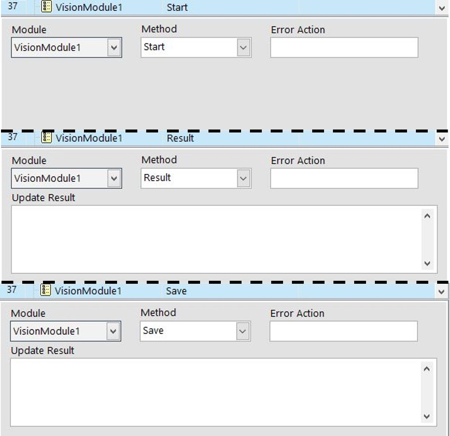
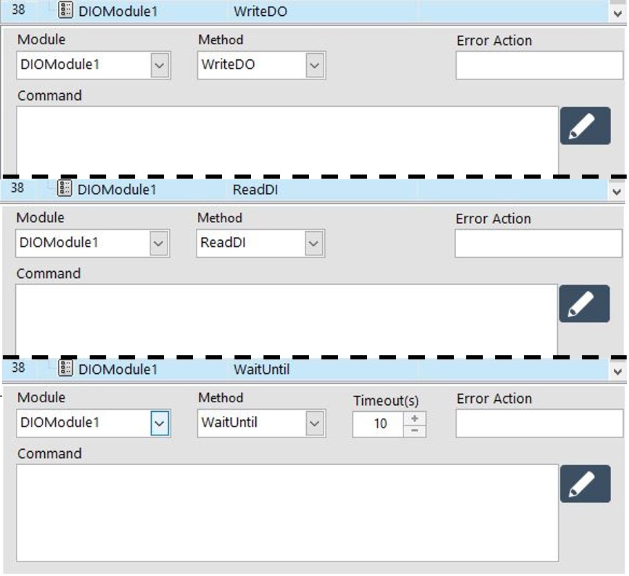

# 模組函式

## \# SmaCOM

呼叫SmaCOM模組進行通訊連線。

| 設定參數 | 參數說明 |
| :--- | :--- |
| 模組\(Module\) | 選擇要執行的模組專案 |
| 方法\(Method\) | 模組要執行的功能 |
| 錯誤名稱\(Error Action\) | 命名模組執行時發生的錯誤 |
| 資料\(Data\) | 接收資料的變數或寫入的資料內容 |

#### \# Method設定方式

* Read : 接收資訊
* Write : 寫入資訊
* Reconnect : 嘗試重新連線

* 讀取資料 : 當要接收外部設備傳來的資料時，直接在Data欄位輸入用來接收資料的變數名稱，變數的資料型態必須為字串變數。
* 寫入資料 : 當要寫入資料到外部設備時，參考下面的範例於Data欄位輸入適當的格式。
  * 直接寫入 : "寫入的文字內容"
  * 透過變數 : Local.變數名稱 \(必須是字串變數\)

## \# SmaMOTION

呼叫SmaMOTION模組進行運動控制。

| 設定參數 | 參數說明 |
| :--- | :--- |
| 模組\(Module\) | 選擇要執行的模組專案 |
| 方法\(Method\) | 模組要執行的功能 |
| 錯誤名稱\(Error Action\) | 命名模組執行時發生的錯誤 |
| 點位\(Position\) | 選擇要移動的點位 |
| 軸選擇\(Axis\) | 選擇要設定的軸編號 |
| 點位\(Position\) | 選擇要移動的點位 |
| 逾時\(Timeout\) | 設定等待時間，超過時間會進入錯誤處 理程序 |
| 命令\(Command\) | 模組執行的動作，直接點擊右側 的編輯標籤進行設定 |

## \# SmaROBOT

呼叫SmaROBOT模組執行手臂控制。

## \# SmaVISION

呼叫SmaVISION模組執行影像處理。

| 設定參數 | 參數說明 |
| :--- | :--- |
| 模組\(Module\) | 選擇要執行的模組專案 |
| 方法\(Method\) | 模組要執行的功能 |
| 錯誤名稱\(Error Action\) | 命名模組執行時發生的錯誤 |
| 更新結果\(Update Result\) | 指派變數去接收影像處理後的結果， 或是輸入影像的儲存路徑 |

#### \# Method設定方式

* Start : 開始執行影像處理
* Result : 讀取影像處理完成後的結果
* Save : 將結果影像進行存檔

## \# SmaDIO

呼叫SmaDIO模組執行擴充IO的功能。

| 設定參數 | 參數說明 |
| :--- | :--- |
| 模組\(Module\) | 選擇要執行的模組專案 |
| 方法\(Method\) | 模組要執行的功能 |
| 錯誤名稱\(Error Action\) | 命名模組執行時發生的錯誤 |
| 逾時\(Timeout\) | 設定等待時間，超過時間會進入錯誤處 理程序 |
| 命令\(Command\) | 模組執行的動作，直接點擊右側 的編輯標籤進行設定 |

#### \# Method設定方式

* WriteDO : 編輯輸出腳位的狀態
* ReadDI : 讀取輸入腳位的狀態
* WaitUntil : 等待輸入腳位到達特定狀態

