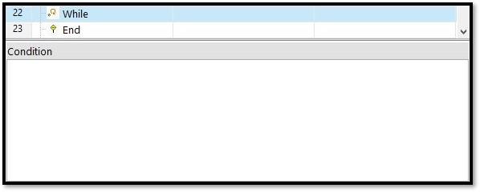

# 迴圈與判斷式

### \# While...End

重複運行While迴圈中的程式內容，直到判斷式的條件被滿足後跳出迴圈，條件式中只能進行最多兩個條件判斷，且兩個條件中的變數必須為相同資料型態。

| 設定參數 | 參數說明 |
| :--- | :--- |
| 條件式\(Condition\) | 判斷是否要跳出While迴圈的條件式 |

#### 。Condition設定方式

* 數值變數 : Local.變數名稱
* 字串變數 : Local.變數名稱=="idle"
* 布林變數 :
  * True -&gt; Local.變數名稱
  * False -&gt; !Local.變數名稱
* &&為且、\|\|為或

### \# If...ElseIf...End

由上而下依序進行條件判斷，當遇到條件成立時運行成立的條件式中的程式，其餘條件式中的程式則不執行，條件式中只能進行最多兩個條件判斷，且兩個條件中的變數必須為相同資料型態。

| 設定參數 | 參數說明 |
| :--- | :--- |
| 條件式\(Condition\) | 判斷是否要執行程式的條件式 |

#### 。Condition設定方式

* 數值變數 : Local.變數名稱
* 字串變數 : Local.變數名稱=="idle"
* 布林變數 :
  * True -&gt; Local.變數名稱
  * False -&gt; !Local.變數名稱
* &&為且、\|\|為或

