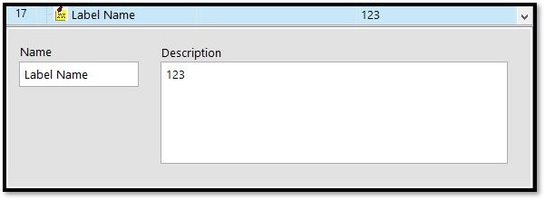
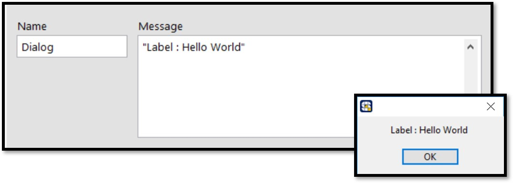
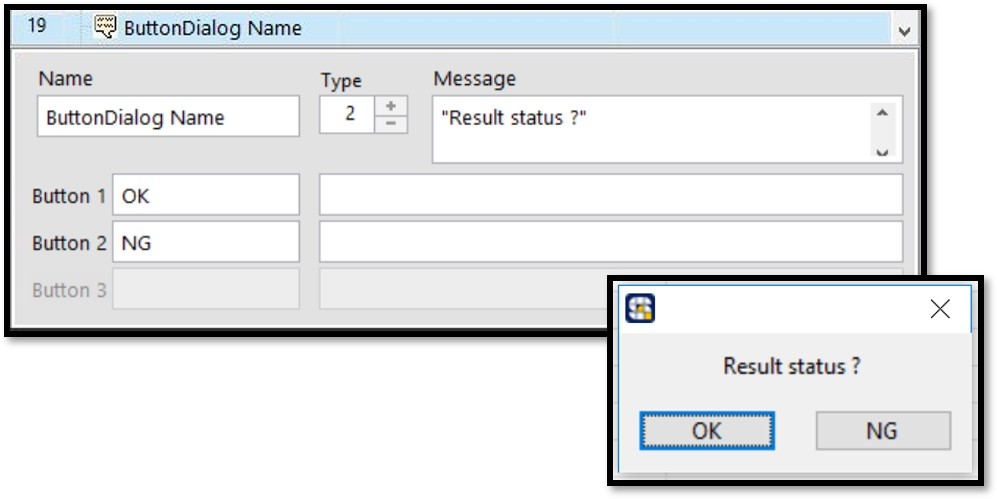
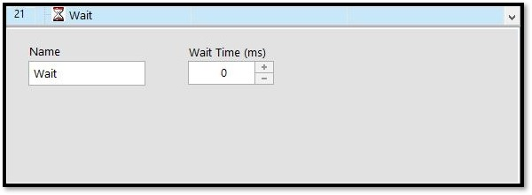

# 一般函式

## \# 標籤\(Label\)

使用於線程的說明與註解，方便程式的閱讀與維護，在線程運作時不會執行，進階功能可做為Action函式的指向目標進行Goto的跳躍。

| 設定參數 | 參數說明 |
| :--- | :--- |
| 名稱\(Name\) | 步驟名稱，可自訂 |
| 內容\(Description\) | 說明與註解 |

## \# 對話框\(Dialog\)

在流程運作中跳出對話視窗，常用於警告使用者軟硬體異常，在對話框出現的期間流程會暫停。

| 設定參數 | 參數說明 |
| :--- | :--- |
| 名稱\(Name\) | 步驟名稱，可自訂 |
| 訊息\(Message\) | 顯示於對話框中的文字 |

直接輸入 : "訊息內容" 字串變數 : Local.變數名稱 數值變數 : str\("Local.變數名稱"\)

### \# 按鈕對話框\(Button Dialog\)

在流程運作中跳出有選項的對話視窗，可依照操作員的選擇執行不同的程式\(表達式\)，在對話框出現的期間流程會暫停，最多支援三個按鈕選項。

| 設定參數 | 參數說明 |
| :--- | :--- |
| 名稱\(Name\) | 步驟名稱，可自訂 |
| 模式\(Type\) | 選擇按鈕的數量 |
| 訊息\(Message\) | 顯示於對話框中的文字 |
| 按鈕 1\(Button 1\) | 按鈕1參數，左側為按鈕上的文字， 右側為Expression函式。 |
| 按鈕 2\(Button 2\) | 按鈕2參數，左側為按鈕上的文字， 右側為Expression函式。 |
| 按鈕 3\(Button 3\) | 按鈕3參數，左側為按鈕上的文字， 右側為Expression函式。 |

#### 。Expression設定方式

* 直接輸入 : "訊息內容" 
* 字串變數 : Local.變數名稱
* 數值變數 : str\("Local.變數名稱"\)

### \# 表達式\(Expression\)

能夠進行變數的寫入以及運算，若在同一個Expression中執行多個表達式運算時，可以用分 號\[;\]進行分隔。

| 設定參數 | 參數說明 |
| :--- | :--- |
| 名稱\(Name\) | 步驟名稱，可自訂 |
| 表達式\(Expression\) | 程式內容 |

#### 。Expression設定方式

* 數值變數 : Local.變數名稱=Local.變數名稱+5
* 布林變數 : Local.變數名稱＝True 
* 字串變數 : Local.變數名稱="文字內容"
* 字串疊加 : Local.變數名稱=Local.變數名稱+"文字內容"

### \# 等待\(Wait\)

在流程步驟之間加入等待時間。

| 設定參數 | 參數說明 |
| :--- | :--- |
| 名稱\(Name\) | 步驟名稱，可自訂 |
| 等待時間\(Wait Time\) | 等待時間，單位為毫秒\(ms\) |

### \# 標準時間\(Time String\)

使用於讀取系統當下的時間。

| 設定參數 | 參數說明 |
| :--- | :--- |
| 名稱\(Name\) | 步驟名稱，可自訂 |
| 格式\(\Formula\) | 讀取的時間格式，可自訂 |
| 變數\(Variable\) | 用於接收讀取的時間，必須是字串變數 |

