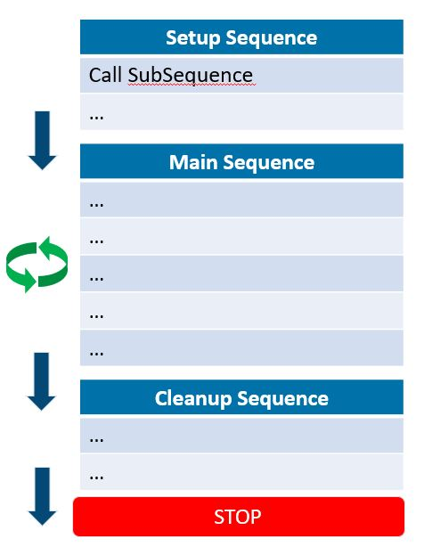

# 線程大綱

在學習如何編寫線程之前，必須先了解它的運作規則。一個完整的自動化線程主要包含三大流程 :

1. **初始化流程\(Setup Sequence\) :** 在機台開始正式進行工作之前所執行的前置動作，例如手臂回原點、伺服軸回原點與變數初始化等動作。
2. **主要流程\(Main Sequence\) :** 機台的主要工作，依照使用者設計的流程能夠達成許多不同的應用。
3. **賦歸流程\(Cleanup Sequence\) :** 在機台關機之前執行的結束動作，例如手臂回安全點、伺服軸回安全點等行為。

如下圖所示，執行一個完整線程首先會執行一次的Setup，確保所有的設備都準備完成，接著進入主要的工作流程Main，此時Main的執行模式會依照Continue?功能的狀態來決定，當Continue?在開啟狀態時，Main流程會重複的循環執行，反之則只會執行一次，當主要流程結束後會進入Cleanup流程進行設備復歸的動作，最後結束線程。

