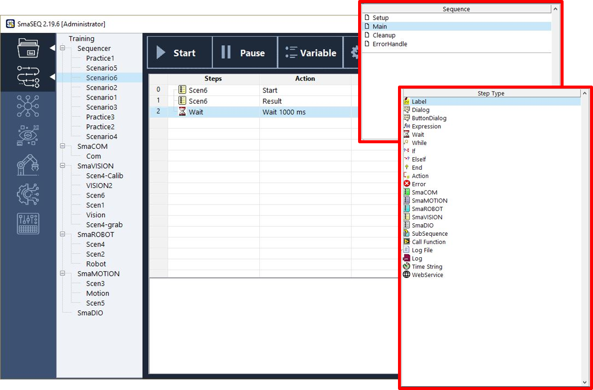

# Sequencer 流程編輯器

## 簡介

### Sequencer 是 SmaSEQ 的核心，以「邏輯」與「順序」概念串連所有所有模組。

在流程中，您可以自由呼叫已設定好的各項模組\(如 SmaROBOT、SmaVISION 等\)，加上條件式、運算式的運用後，即可以輕鬆且快速地編排出屬於自己的專案。

## 基本組成

#### Sequencer 主要由下列要素所構成：

* **流程 Sequence （執行續）**
  * **系統預設的主流程**
  * **使用者自定義的子流程**
* **變數表**
* **流程編輯**
  * **步驟函式庫**
  * **步驟設定欄**
* **操作員介面**

關於這些要素的功能與操作方式，將會在本章節中一一說明

## 介面介紹

* **主流程列表：**Sequencer 建立時自動生成流程框架，包含 Setup、Main、Cleanup 與ErrorHandle 。
* **子流程列表：**自定義的子流程列表，使用者可在此自由增刪、編輯。
* **步驟函式庫：**使用者可在此找到流程編排時，可呼叫的所有功能，雙擊即可將步驟函式加到流程編排視窗中。有關個步驟函式的使用方法，請參考《步驟函式庫》。
* **流程編排視窗：**以行程表的型式，列出專案流程，使用者可自由排序、一目瞭然。
* **步驟函式參數設定欄：** 流程中的每個步驟，都有其專屬的功能與參數。使用者可點選流程編排視窗中的步驟，在本欄位進行編輯。

