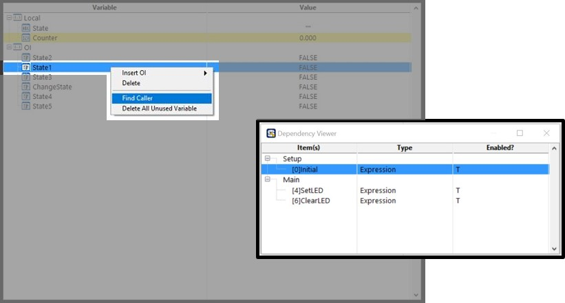
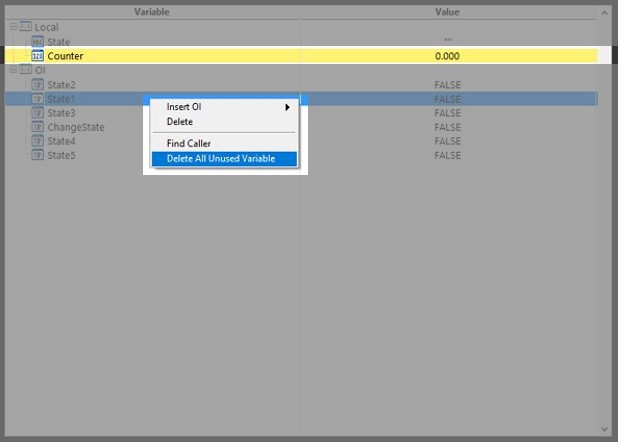

# 變數表的進階功能

當線程的複雜度增加，使用到越來越多的變數後，變數的管理就會變得相當困難，想在眾多的流程中找到呼叫特定變數的步驟有如打海撈針，此時尋找參考與一件刪除的功能就解決您的問題。

想知道線程中哪一個步驟呼叫到特定變數時，只要選取想要搜尋的變數並按下右鍵 -&gt; find caller，即可看到線程中所有使用到該變數的步驟。

您可能會發現在變數表中有一些被標註為黃底的變數，這些被標註為黃底的變數代表並沒有在線程中被使用到，這時候在變數表中任何地方按下右鍵 -&gt; Delete All Unused Variable，可以快速地將所有無用的變數處理掉。

