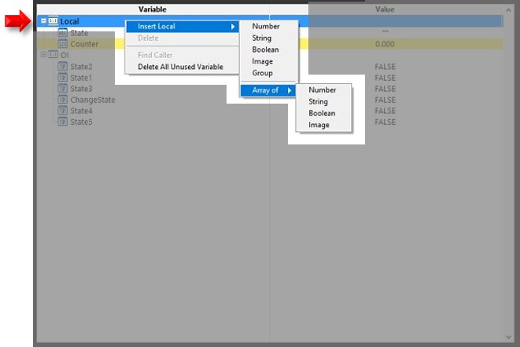
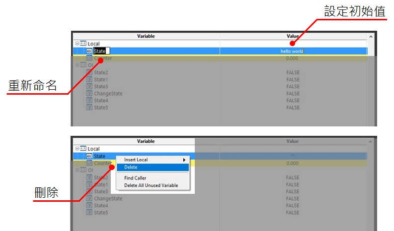

# 變數表的基本功能

## \# 變數的新增、重新命名、設定初值與刪除

線程變數的新增方式是透過點選Local群組後按下右鍵 -&gt; Insert Local進行增加，能夠新增的變數型別為 :

*  **數字變數\(Number\) :** 傳遞整數或浮點數資訊的變數型別。
*  **字串變數\(String\) :** 傳遞文字資訊的變數型別。
*  **布林變數\(Boolean\) :** 傳遞布林\(TRUE\FALSE\)的變數型別。
*  **圖像變數\(Image\) :** 傳遞圖像的變數型別。
*  **陣列變數\(Array\) :** 傳遞陣列的變數型別，陣列的元素可以是數字、字串、布林或圖像。
*  **自訂群組\(**Group\) :\*\* 讓使用者能夠替變數自訂群組歸類，方便進行管理與分類。

針對建立完成的變數，對著變數名稱快速點擊兩下可以更改變數名稱，同樣的，在變數數值的位置快速點擊兩下則可以設定變數的初始值，而對著選取的變數點選右鍵可以刪除變數。

