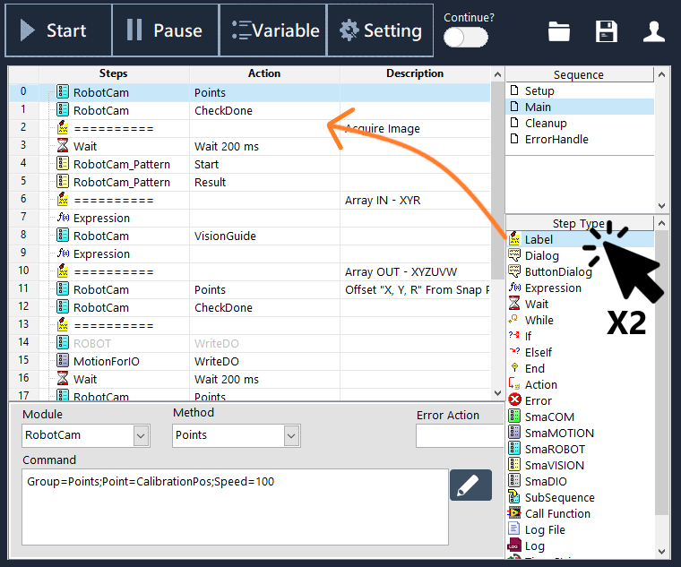
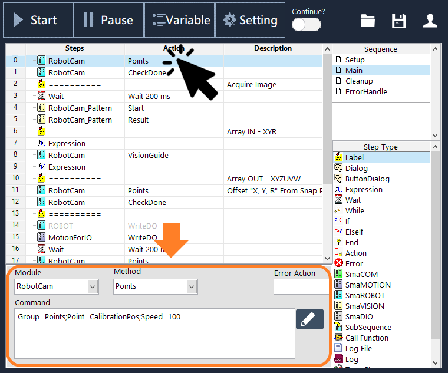
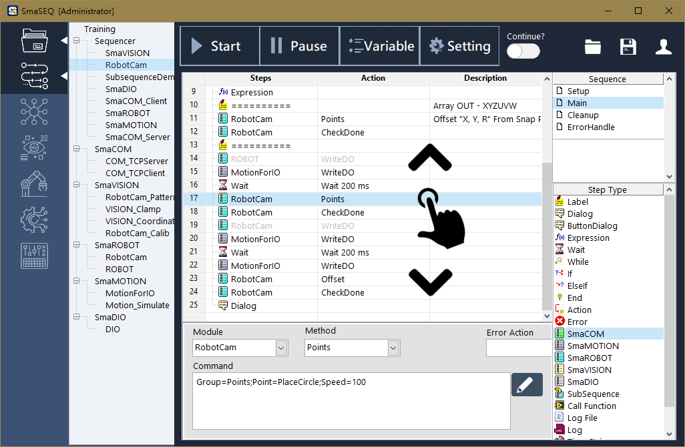
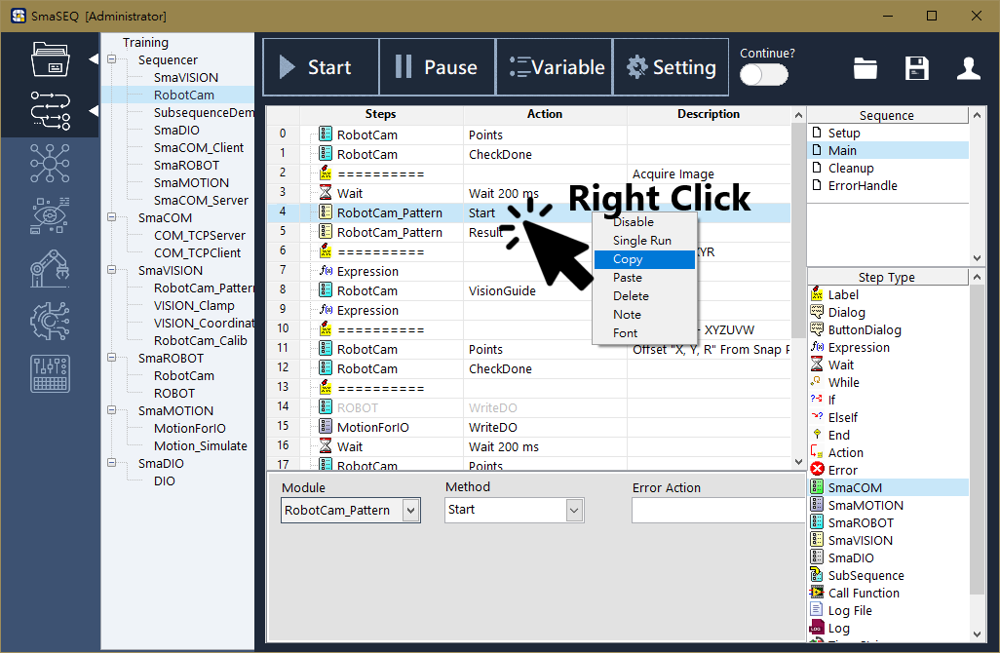

# Steps - 流程編輯

#### 本章將介紹如何在 Sequencer 中呼叫步驟函式、編輯流程，並說明各項步驟函式的功能與設定方式。

在開始編輯流程前，可以先思考一些問題，可幫助流程編寫時更加行雲流水

* 需要哪些模組功能？
* 需要怎樣的邏輯判斷式？
* 動作的運行順序為何？ 
* 是否存在重複的動作可以寫成子流程？

## 開始編排流程

### 當其他模組功能已設定完成後，即可開始進行流程編排。

#### 加入步驟

* 在流程編排視窗中，點選您想要插入步驟的位置。
* 在右下角的步驟函式列表中找到需要的功能，以左鍵連點兩下步驟函式，即可以將其加入當前的流程中。
* 若沒有選擇想插入函式的位置，則新增的功能會插在流程的最上面變成Step 0。

#### 編輯步驟

在流程編排視窗中，點選欲編輯的步驟，即可於步驟編輯欄位進行該步驟的設定。

#### 操作已加入流程的步驟

點擊流程中的步驟可上下拖曳，輕鬆編排順序

在步驟上點右鍵，可開啟操作選項

* Disable 關閉功能：可讓流程運行時，忽略該步驟。
* SingleRun 單步驟運行：\(此步驟尚未開放\)
* Copy 複製：複製步驟。
* Paste 貼上：貼上已被複製的步驟。
* Delete 刪除：刪除步驟。
* Note 註解：為步驟加上註解，可幫助快速理解該步驟的用途。
* Font 字體：更改該步驟名稱的字體、顏色，可讓提高流程的可讀性。

## 步驟函式列表

* Label 標籤
* Dialog 通知對話框
* Button Dialog 選項對話框
* Expression 表達式
* Wait 延遲
* While...End 迴圈
* If...ElseIf...End 條件式
* Action 流程控制
* Error 錯誤觸發
* SmaCOM 通訊模組
* SmaMOTION 馬達模組
* SmaROBOT 手臂模組
* SmaVISION 視覺模組
* SmaDIO 數位訊號模組
* SubSequence 子流程呼叫
* Call Function 外部程式呼叫
* Log File 儲存文字檔
* Log 儲存資料庫
* Time String 時間戳記字串

