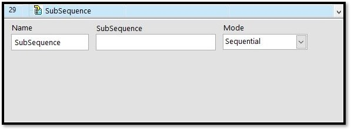

# 副線程函式

## \# 副線程\(SubSequence\)

用於呼叫副線程，可幫助整理主線程或是設計多線程架構。

| 設定參數 | 參數說明 |
| :--- | :--- |
| 名稱\(Name\) | 步驟名稱，可自訂 |
| 副線程\(SubSequenc\) | 要呼叫的副線程名稱 |
| 運行模式\(Mode\) | 副線程的運作模式，詳細請 參考\[[包裝您的流程\(Subsequence\)](../../liu-cheng-sequence-zhi-hang-xu/bao-nin-de-liu-cheng-subsequence.md)\] |

