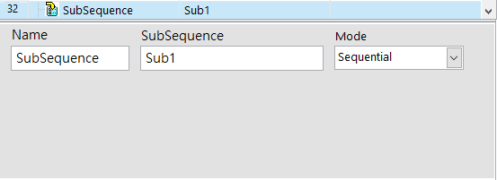
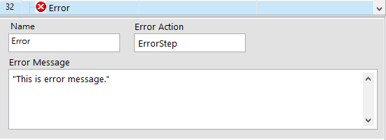

# 進階步驟函式

## \# 呼叫子流程【SubSequence】

#### 用於呼叫子流程運行，並指定其運作模式。

| 參數 | 說明 |
| :--- | :--- |
| Name | 步驟名稱。此名稱會顯示在流程步驟上。 |
| SubSequence | 要呼叫的子流程名稱。 |
| Mode | 指定子流程的運作模式。 |

#### Mode 類別說明

* **Sequential：**
  * **說明**
    * 使用這個指令呼叫 Subsequence 者，會等待該 Subsequence 執行完畢才繼續運行。
  * **主要用途**
    * 整理、簡化流程。
  * **使用時機**
    * 任何流程的任何地方皆可使用
* **Parallel：**
  * **說明**
    * 使用這個指令呼叫 Subsequence 者，不會等待該 Subsequence 執行完畢；該 Subsequence 在被呼叫後會執行一次即停止。
  * **主要用途**
    * 將某個工作階段平行運行，省去乎相等待的時間。
  * **使用時機**
    * 任何流程的任何地方皆可使用
* **AutoRun：**
  * **說明**
    * 使用這個指令呼叫 Subsequence 者，不會等待該 Subsequence 執行完畢；該 Subsequence 在被呼叫後會執行一次即停止。
  * **主要用途**
    * 獨立出新的執行緒，可單獨編寫獨立的運作流程。
  * **使用時機**
    * 建議僅在 Setup 主流程時使用此指令。

## \# 觸發錯誤【Error】

#### 流程執行到此步驟會觸發錯誤程序、將錯誤名稱記錄到 Error.Action 變數，並暫停所有流程後喚醒 ErrorHandle 執行錯誤處理流程。

| 可設定參數 | 說明 |
| :--- | :--- |
| Name | 步驟名稱。此名稱會顯示在流程步驟上。 |
| Error Action | 定義本步驟的錯誤名稱，觸發時會寫進 Error.Action 變數。 |
| Error Message | 定義本步驟的錯誤訊息，觸發時會寫進 Error.Msg 變數。 |


有關 ErrorHandle 的詳細說明，請參閱《在 ErrorHandle 編輯專案的錯誤處理流程》




## \# 流程控制【Action】\*僅供 ErrorHandle 使用

#### 在 ErrorHandle 中，我們可利用 Action 函式控制流程的運行狀態。

| 參數 | 說明 |
| :--- | :--- |
| Name | 步驟名稱。此名稱會顯示在流程步驟上。 |
| Action | 控制流程的方法 |
| Sequence | 當 Action 選擇 Goto 方法時，可指定流程名稱。 |
| Index | 當 Action 選擇 Goto 方法時，可指定步驟編號。 |

#### Action 方法類型

* **Continue：**解除暫停狀態，從暫停的步驟繼續運行流程。
* **Pause：**暫停流程 \(通常僅在測試流程階段時會使用到\)。
* **Goto：**指定特定流程的步驟，作為流程繼續運行時的起始點。
  * Goto 的使用方法有兩種，並以第一種方式優先參考
    * 在 Sequence 欄位中，使用 `SequenceName@LabelName` 格式，Goto會到指定的流程名稱中，尋找該 Label 名稱作為起始點。
    * 在 Sequence 欄位中，僅指定 SequenceName ，並在 Index 欄位中給予步驟編號。
* **Cleanup：**直接進入Cleanup流程。
* **Abort：**強制關閉所有流程。

