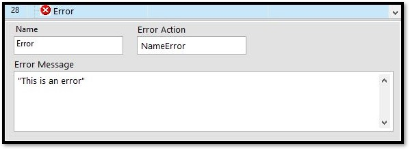
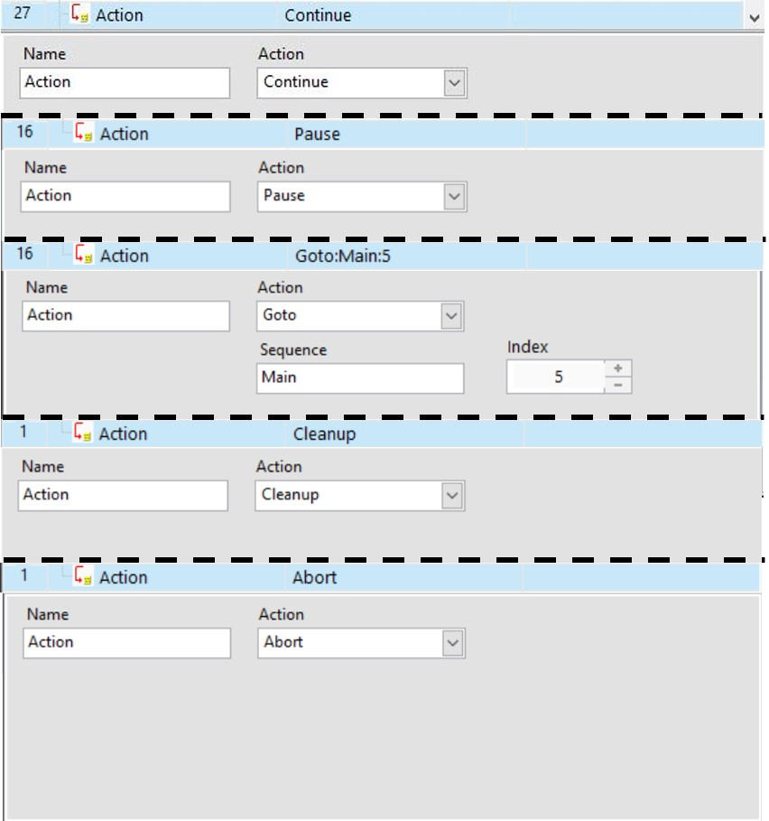

# 錯誤處理相關函式

## \# 錯誤\(Error\)

當流程執行到此步驟時直接觸發錯誤程序，暫停所有線程並且進入ErrorHandle，錯誤名稱會記錄到Error.Action的系統變數，而錯誤訊息則是記錄到Error.Msg的系統店數當中，兩者一併傳到ErrorHandle裡面進行錯誤處理。

| 設定參數 | 參數說明 |
| :--- | :--- |
| 名稱\(Name\) | 步驟名稱，可自訂 |
| 錯誤名稱\(Error Action\) | 錯誤的名稱，可自訂 |
| 錯誤訊息\(Error Message\) | 錯誤訊息，用於告知操作員錯誤原因 |

## \# 行為\(Action\) \[限ErrorHandle使用\]

在ErrorHandle中完成錯誤處理程序後，需指定流程的下一步該如何繼續運行，其中Goto的使用方式請參考\[[流程中的錯誤處理\(ErrorHandle\)](../../liu-cheng-sequence-zhi-hang-xu/liu-cheng-zhong-de-li-errorhandle.md)\]。

| 設定參數 | 參數說明 |
| :--- | :--- |
| 名稱\(Name\) | 步驟名稱，可自訂 |
| 行為\(Action\) | 下一步的流程動作 |
| 線程\(Sequence\) | 指定要Goto的線程 |
| 目錄\(Index\) | 指定要Goto的步驟編號 |

### 。Action模式

* Continue : 從暫停的狀態繼續運行 
* Pause : 暫停流程
* Goto : 繼續運行時，指定特定流程的起始步驟
* Cleanup : 直接進入Cleanup流程
* Abort : 強制關閉所有流程

在上述的操作中，Goto的使用方式可以細分為2種，第一種是選擇特定流程的特定步驟，如:Main的Step 5、Setup 的 Step 9等方式，第二種方法是選擇特定的Label流程函式進行跳躍，輸入格式為\[流程@Label名稱\]，例如:Setup@Label3、Main@Label6，詳細的設定方式可以參考\[[函數的功能與參數設定方式](./)\]。

另外需要注意的是Action的Goto只是改變流程繼續執行的位置，必須要再加入Action的Continue流程才會繼續運作。

