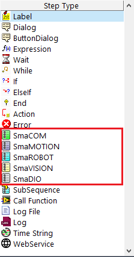

# 模組步驟函式

#### SmaSEQ 可在流程中命令模組動作，而各模組各自有其可使用的指令，本節將詳細介紹各種指令的設定方式與語法。

### \#命令通訊連線模組【SmaCOM】

* **Write**（送資料）
* **Read**（收資料）
* **Reconnect**（重新連線）

### \#命令機器視覺模組【SmaVISION】

* **Start**（開始）
* **Result**（紀錄結果）
* **Save**（存圖）

### \#命令機械手臂模組【SmaROBOT】

* **Point**（指定移動目標點）
* **VisionGuide**（視覺導引座標換算）
* **Offset**（移動特定值）
* **CheckDone**（確認移動完成）
* **WriteDO**（改變數位輸出訊號）
* **ReadDI**（紀錄數位輸入訊號）
* **WaitUntil**（等待數位輸入訊號）

### \#命令運動控制模組【SmaMOTION】

* **Move**（指定移動目標點）
* **Home** / **AllHome**（回原點）
* **CheckDone** / **AllCheckDone**（確認移動完成）
* **WriteDO**（改變數位輸出訊號）
* **ReadDI**（紀錄數位輸入訊號）
* **WaitUntil**（等待數位輸入訊號）
* **SetOrigin**（設定為原點）
* **Stop**（停止移動）
* **ReadPosition**（紀錄當下位置）
* **AlarmReset**（重置軸卡警報）

### \#命令數位訊號模組【SmaDIO】

* **WriteDO**（改變數位輸出訊號）
* **ReadDI**（紀錄數位輸入訊號）
* **WaitUntil**（等待數位輸入訊號）


有關 Error Action 欄位名稱的具體功能，請參考《在 ErrorHandle 編輯專案的錯誤處理流程》


