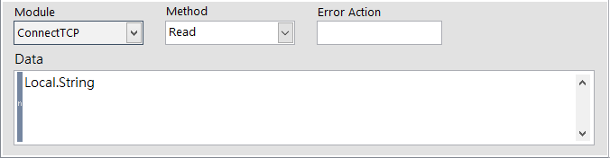
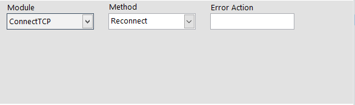

# \#命令通訊連線模組【SmaCOM】

### 命令指定的 SmaCOM Module 執行動作指令。

| 參數 | 說明 |
| :--- | :--- |
| Module | 選擇要命令的模組。 |
| Method | 選擇動作指令。 |
| Error Action | 命名錯誤名稱。當此步驟發生錯誤時，將紀錄此名稱。 |
| Data | 填入語法 |


有關 Error Action 欄位名稱的具體功能，請參考《在 ErrorHandle 編輯專案的錯誤處理流程》


## Method 動作指令與語法

### &lt; **Read** &gt; **，從連線對象接收資料**

* **Data 參數：**
  * 依據傳送端的資料內容，選擇適當的變數型態以接收資料 \(Numeric / String\)
  * 語法：\(假設完整接收訊息為 _Receive Message : Hello World_ \)
    * **字串變數 -** `Local.String` ，以 〔Local.String〕字串變數接收全部訊息內容
    * **字串+字串變數 -** `"Receive Message : "+Local.String` ，程式會過濾前段的 _Receive Message :_ ，僅將 _Hello World_ 紀錄進字串變數 〔Local.String〕

###  ****&lt; **Write** &gt; **，將資訊傳送至連線對象**

* **Data 參數：**
  * 將欲傳送的資料，以**字串型態**寫入給接收端
  * 語法：\(假設欲傳送的訊息為 _Reply : Smasoft_ \)
    * **純字串 -** `"Reply : Smasoft"` ，將訊息直接以雙引號包裝送出
    * **字串+字串變數 -** `"Reply : "+Local.String`，其中 〔Local.String〕 的值為 _Smasoft_ 。
    * **字串變數 -** `Local.String`，其中 〔Local.String〕 的值為 _Reply : Smasoft_ 。

### &lt; Reconnect &gt; **，與連線對象重新嘗試連線**

* 無須設定其他參數

