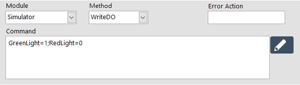
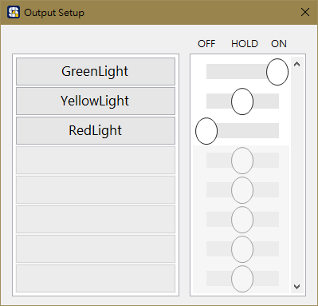
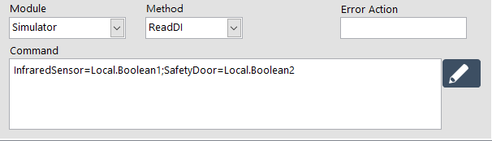
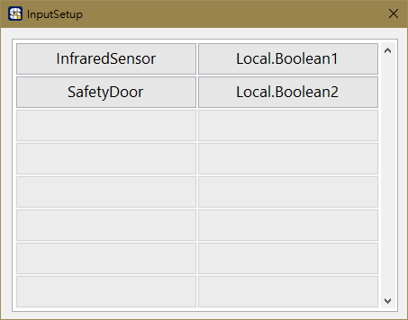
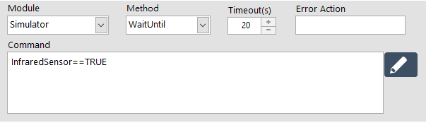
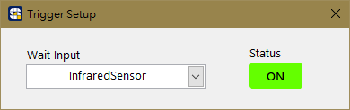

# \#命令數位訊號模組【SmaDIO】

### 命令指定的 SmaDIO Module 執行動作指令。

| 參數 | 說明 |
| :--- | :--- |
| Module | 選擇要命令的模組。 |
| Method | 選擇動作指令。 |
| Error Action | 命名錯誤名稱。當此步驟發生錯誤時，將紀錄此名稱。 |
| Timeout | 設定等待時間，超過時間會觸發超時錯誤，進入錯誤處理程序。 |
| Command | 填入指令語法，可點擊右側的編輯標籤進行設定。 |


有關 Error Action 欄位名稱的具體功能，請參考《在 ErrorHandle 編輯專案的錯誤處理流程》


## Method 動作指令與語法

### **&lt; WriteDO &gt; ，改變數位訊號卡的數位輸出訊號**

* **Command：**
  * 使用右側的編輯標籤，指定 DO 的狀態，可為 On / Hold / Off。DO 的名稱在 SmaDIO 模組中由使用者自行定義。
    * On - 數位訊號變為 True
    * Hold - 數位訊號保持原本狀態
    * Off - 數位訊號變為 False


關於 SmaDIO 的 DIO 設定方式，請參考《SmaDIO模組》


### **&lt; ReadDI &gt; ，讀取數位訊號卡當下的數位輸入訊號**

* **Command：**
  * 使用右側的編輯標籤，為需要紀錄的 DI 訊號指派 Boolean 變數。DI 的名稱在 SmaDIO 模組中由使用者自行定義。

### **&lt; WaitUntil &gt; ，等待數位訊號卡的數位輸入訊號變為期望的狀態**

* **Command：**
  * 使用右側的編輯標籤，指定 DI 訊號點，與期望的訊號狀態。DI 的名稱在 SmaDIO 模組中由使用者自行定義。

