# 命令運動控制模組【SmaMOTION】

### 命令指定的 SmaMOTION Module 執行動作指令。

| 參數 | 說明 |
| :--- | :--- |
| Module | 選擇要命令的模組。 |
| Method | 選擇動作指令。 |
| Error Action | 命名錯誤名稱。當此步驟發生錯誤時，將紀錄此名稱。 |
| Position | 指定模組中的目標點位 |
| Axis | 選擇要指定的軸號 |
| Timeout | 設定等待時間，超過時間會觸發超時錯誤，進入錯誤處理程序 |
| Command | 填入指令語法，可點擊右側的編輯標籤進行設定。 |


有關 Error Action 欄位名稱的具體功能，請參考《在 ErrorHandle 編輯專案的錯誤處理流程》


## Method 動作指令與語法

### &lt; Move &gt; **，命令馬達移動**

* **Position：**
  * 指定運動控制模組中的點位，做為馬達移動的目標。

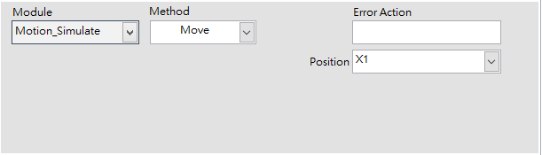

### &lt; Home &gt; / &lt; AllHome &gt; **，命令馬達回 Home 點**

* **Axis：**
  * 指定一軸執行 Home 指令。
* AllHome 則每一軸都會回 Home 點，不須指定 Axis。

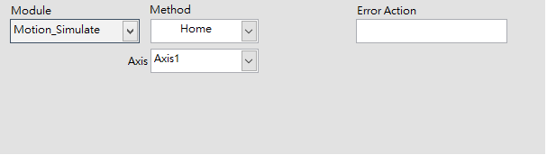

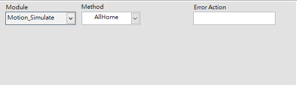

### &lt; CheckDone &gt; / &lt; AllCheckDone &gt; **，等待馬達到達定位**

* **Axis：**
  * 指定一軸執行 CheckDone 指令
* **Timeout：**
  * 等待的時間上限
* AllCheckDone 則每一軸都會等待 CheckDone，不須指定 Axis。

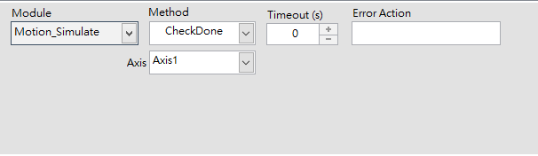

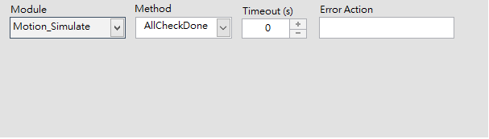

### &lt; WriteDO &gt; **，改變馬達軸卡的數位輸出訊號**

* **Command：**
  * 使用右側的編輯標籤，指定 DO 的狀態，可為 On / Hold / Off。DO 的名稱在 SmaMOTION 模組中由使用者自行定義。
    * On - 數位訊號變為 True
    * Hold - 數位訊號保持原本狀態
    * Off - 數位訊號變為 False

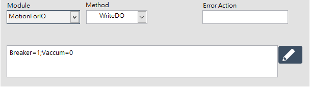

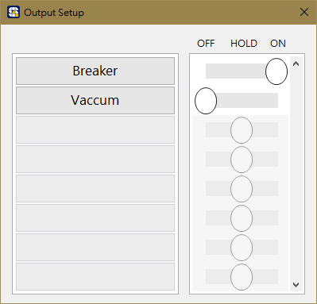


關於 SmaMOTION 的 DIO 設定方式，請參考《SmaMOTION 模組 - 軸卡 DIO》


### &lt; **Read**DI &gt; **，讀取馬達軸卡當下的數位輸入訊號**

* **Command：**
  * 使用右側的編輯標籤，為需要紀錄的 DI 訊號指派 Boolean 變數。DI 的名稱在 SmaMOTION 模組中由使用者自行定義。

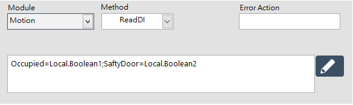

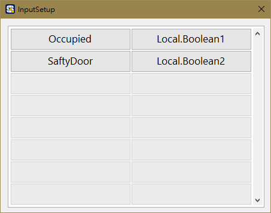

### &lt; **WaitUntil** &gt; **，等待軸卡的數位輸入訊號變為期望的狀態**

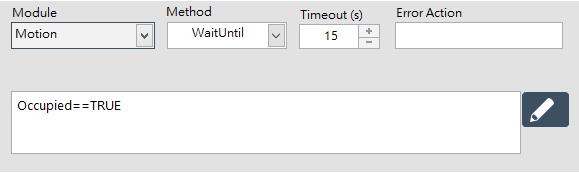

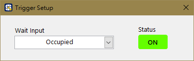

* **Command：**
  * 使用右側的編輯標籤，指定 DI 訊號點，與期望的訊號狀態。DI 的名稱在 SmaMOTION 模組中由使用者自行定義。

### &lt; SetOrigin &gt;**，指定馬達當下位置為原點**

* **Axis：**
  * 指定一軸執行 SetOrigin 指令。

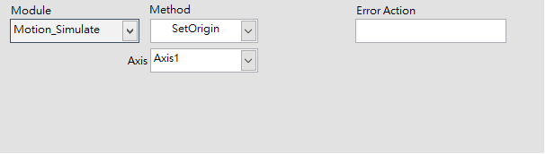

### 「Stop」**，命令馬達停止**

* **Axis：**
  * 指定一軸執行 Stop 指令。

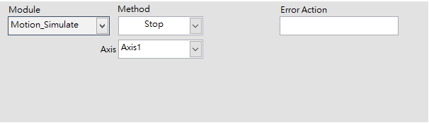

### &lt; ReadPosition &gt;**，讀取馬達當下位置**

* **Axis：**
  * 指定一軸執行 ReadPosition 指令。
* **Command：**
  * 指派一個數值變數，接收馬達當前的位置資訊

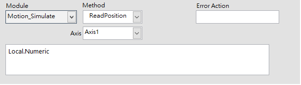

### &lt; AlarmReset &gt;**，重置軸卡警報**

* **Axis：**
  * 指定一軸執行 Alarm 指令。

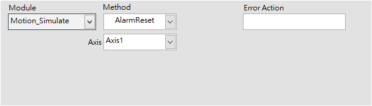

