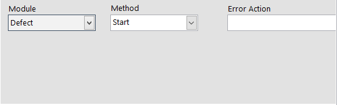
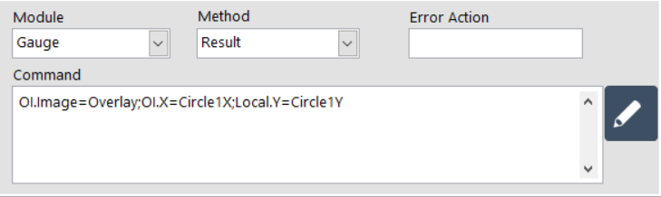
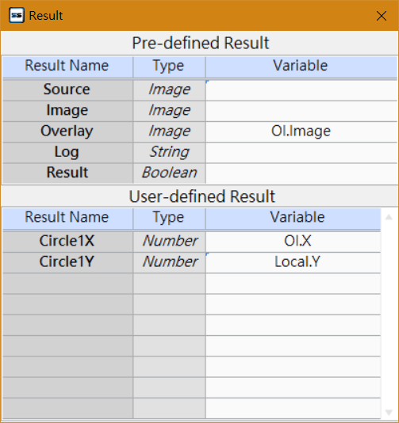
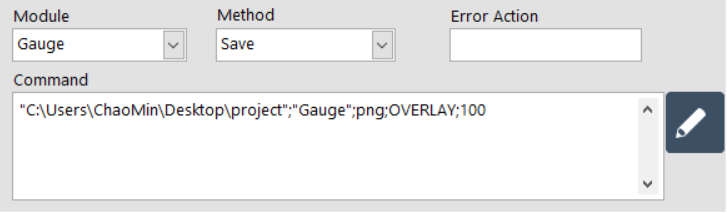
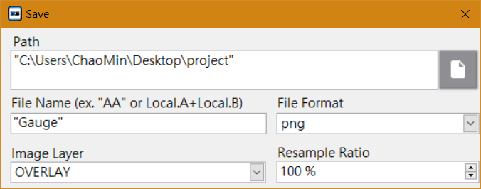

# 命令機器視覺模組【SmaVISION】

### 命令指定的 SmaVISION Module 執行動作指令。

| 參數 | 說明 |
| :--- | :--- |
| Module | 選擇要命令的模組。 |
| Method | 選擇動作指令。 |
| Error Action | 命名錯誤名稱。當此步驟發生錯誤時，將紀錄此名稱。 |
| Update Result | 填入指令語法 |


有關 Error Action 欄位名稱的具體功能，請參考《在 ErrorHandle 編輯專案的錯誤處理流程》


## Method 動作指令與語法

###  ****&lt; **Start** &gt; **，開始運作**

* 無須設定其他參數

### &lt; **Result** &gt; **，等待視覺模組完成動作**

* **Update Result 參數**
  * 指派變數，負責接收結果數值。按下右方**編輯按鈕**即可開啟編輯視窗。
  * 設定：
    * SmaVISION 預設輸出值
      * **Source（原圖）**，數值型態為 Image（影像）
      * **Image（影像成果圖）**，數值型態為 Image（影像）
      * **Overlay（原圖+標記）**，數值型態為 Image（影像）
      * **Log** 紀錄了全部影像步驟的數值資訊、執行時間等，數值型態為 String（字串）。
      * **Result** 顯示模組執行後的結果，數值型態為 Boolean（布林）。
    * 使用者於該視覺模組中定義的化名輸出數值


有關化名的介紹與操作方式，詳見《SmaVISION模組 - 結果數據處理》


### &lt; **Save** &gt; **，將視覺影像輸出成圖**

* **Update Result 參數**
  * 指定存放圖片的路徑與名稱。按下右方**編輯按鈕**即可開啟編輯視窗。
  * 設定：
    * **Path**：選擇存放路徑。
    * **File Name**：給予檔案名稱。
    * **File Format**：指定圖片格式。
    * **Image Layer**：選擇影像圖層。圖層如同 Result 步驟，包含（Source / Image / Overlay）
    * **Re-sample Ratio**：選擇圖片的縮放比例。

