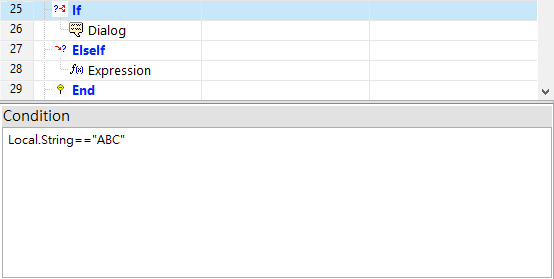

# 迴圈與條件式步驟函式

## \# 迴圈【While】...【End】

#### 迴圈會重複運行 While ... End 框架內的步驟，直到 While 中的條件被滿足，才會離開迴圈。

#### 條件式中，一次最多只能給予兩個條件。

| 可設定參數 | 說明 |
| :--- | :--- |
| Condition | 判斷是否要離開 While 迴圈的條件 |

條件語法詳見本頁下方。

## \# 條件式【If】...【ElseIf】...【End】

#### If ... ElseIf ... End 架構的判斷方式為由上而下依序進行，當遇到成立的條件時即運行該條件下的步驟，且不再進行其他的條件判斷。

#### 條件式中，一次最多只能給予兩個條件。

| 可設定參數 | 說明 |
| :--- | :--- |
| Condition | 判斷是否要執行底下步驟的條件 |

### Condition語法

* 以數值變數為條件
  * `Local.Numeric<=5`
  * `Local.Numeric==8`
* 以字串變數為條件
  * `Local.Numeric=="Idle State"`
* 以布林變數為條件
  * 當布林為True
    * `Local.Boolean`
  * 當布林為False
    * `!Local.Boolean`
* 各式符號意義
  * &&（且）
    * `Local.Numeric>=5&&Local.String!="Run"`
  * \|\|（或）
    * `Local.Numeric<5||Local.Numeric>10`
  * ==（等於）
  * !=（不等於）
  * &gt;=（大於或等於）
  * &lt;=（小於或等於）

