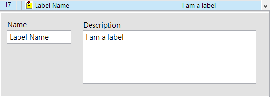
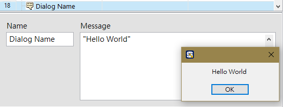
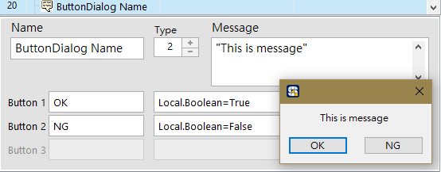
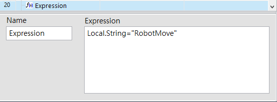
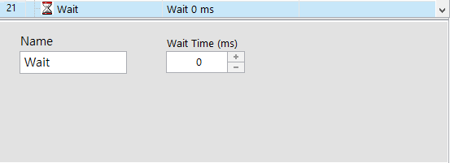
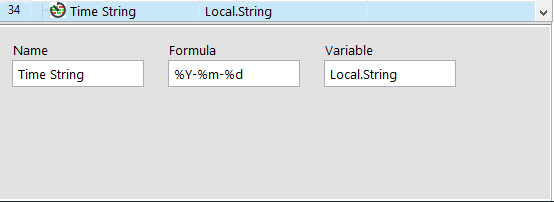

# 基本步驟函式

## \# 標籤【Label】

#### 以步驟的形態存在的註解，沒有實質的動作會進行，其主要功能有：

* 在流程中插入標籤註解，可增加流程的可讀性
* 可作為【Action】步驟函式的 &lt; Goto &gt; 方法所指向的標的位置，詳見《進階函式》。

| 參數 | 說明 |
| :--- | :--- |
| Name | 步驟名稱。此名稱會顯示在流程步驟上。 |
| Description | 標籤的說明文字。中英文皆可。 |

## \# 通知型對話框【Dialog】

#### 流程運行到這一步時會跳出對話框，同時該流程會暫停。僅有單一按鈕能關閉對話框。

| 參數 | 說明 |
| :--- | :--- |
| Name | 步驟名稱。此名稱會顯示在流程步驟上。 |
| Message | 顯示於對話框中的文字，以字串方式呈現。 |

#### Message語法

* **直接輸入**欲顯式的文字
  * `"This is a Message"`
* 以**字串變數**作為顯示文字
  * `Local.string`
* 以**數值變數**作為顯示文字
  * `str("Local.Numeric")`

## \# 互動型對話框【Button Dialog】

#### 流程運行到這一步時會跳出對話框，同時該流程會暫停。可設定 1~3 個按鈕作為選項，各選項皆附帶【Expression】功能，會根據選擇決定執行哪一欄。

| 參數 | 說明 |
| :--- | :--- |
| Name | 步驟名稱。此名稱會顯示在流程步驟上。 |
| Type | 指定的按鈕數量。 |
| Message | 顯示於對話框中的文字，以字串方式呈現。 |
| Button 1 | 左側為按鈕的名稱；右側為【Expression】函式。 |
| Button 2 | 左側為按鈕的名稱；右側為【Expression】函式。 |
| Button 3 | 左側為按鈕的名稱；右側為【Expression】函式。 |

關於 Expression 的語法，請見下方說明 - 表達式【Expression】

#### Message 語法

* **直接輸入**欲顯式的文字
  * `"This is a Message"`
* 以**字串變數**作為顯示文字
  * `Local.string`
* 以**數值變數**作為顯示文字
  * `str(Local.Numeric)`

## \# 表達式【Expression】

#### 可進行變數值的異動，與各種數學運算。一個 Expression 可執行多項動作，每個動作間需以「**；**」分隔（請勿輸入空白與換行）。

| 參數 | 參數說明 |
| :--- | :--- |
| Name | 步驟名稱。此名稱會顯示在流程步驟上。 |
| Expression | 運行內容。 |

#### Expression 語法

* **數值變數**
  * 寫入
    * `Local.Numeric=3.14`
  * 運算
    * 各種 +, -, \*, / 數學運算
      * `Local.Numeric3=Local.Numeric1+Local.Numeric2`
      * `Local.Numeric=Local.Numeric/5`
    * 數學函式 \(以常見的為例\)
      * 一般功能
        * abs\(x\) - 回傳 x 的絕對值。
        * sqrt\(x\) - 計算 x 的開根號結果。
        * pi\(x\) - 計算 pi \* x 。
        * rand\(x\) - 產生 0 和 1 之間的隨機數值。
        * ceil\(x\) - 將小數點進位到整數。
        * floor\(x\) - 將小數點捨去到整數。
        * exp\(x\) - x 的 exponential 值。
        * log\(x\) - 計算 x 的 log 值 \(以 10 為底數\)。
        * ln\(x\) - 計算 x 的 log 值 \(以 exponential 為底數\)。
        * sign\(x\) - 回傳數值的符號。大於零則為1，等於零則為0，小於零則為 -1。 
      * 三角函數
        * sin\(x\) - x 的 sine 值。 \(x 以弧度為單位\)。
        * cos\(x\) - x 的 cosine 值。 \(x 以弧度為單位\)。
        * tan\(x\) - x 的 tangent 值。 \(x 以弧度為單位\)。
        * asin\(x\) - x 的 arcsine 弧度值。
        * acos\(x\) - x 的 arccosine 弧度值。
        * atan\(x\) -  x 的 arctangent 弧度值。
        * sinh\(x\) - x 的雙曲正弦函數值。
        * cosh\(x\) - x 的雙曲餘弦函數值。
        * tanh\(x\) - x的雙曲正切函數值。
* **布林變數**
  * 寫入
    * `Local.Boolean＝True`
    * `Local.Boolean＝False`

 
* **字串變數**
  * 寫入
    * `Local.String="Input String"`
  * 字串串連
    * `Local.String=Local.String+"ZZZ"` \(若 Local.String 原本為 ABC，疊加後會變成 ABCZZZ\)

## \# 延遲【Wait】

#### 在流程步驟之間提供延遲等待的時間。

| 參數 | 參數說明 |
| :--- | :--- |
| Name | 步驟名稱。此名稱會顯示在流程步驟上。 |
| Wait Time | 等待時間，單位為毫秒\(ms\) |

## \# 時間戳記【Time String】

使用於讀取系統當下的時間。

| 參數 | 參數說明 |
| :--- | :--- |
| Name | 步驟名稱。此名稱會顯示在流程步驟上。 |
| Formula | 時間的字串格式，可自訂樣式。 |
| Variable | 填入**字串變數**，用於接收當下的時間字串。 |

#### Formula 語法

* 可選用戳記
  * %c（YYYY/mm/dd &lt;am \| pm&gt; HH:MM:SS）
  * %x（"YYYY/mm/dd）
  * %X （&lt;am \| pm&gt; HH:MM:SS）
  * %Y（四位數年份）
  * %m（月份）
  * %d（日）
  * %H（時）
  * %M（分）
  * %S（秒）
  * %3u（毫秒至小數點以下三位）
* 組合範例
  * `%c` → "2019/10/30 上午 11:52:52"
  * `%Y-%m-%d` → "2019-10-30"
  * `%H:%M:%S%3u` → "11:52:38.592"

