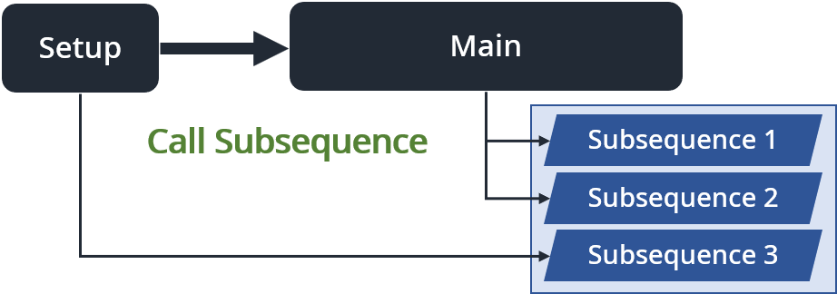

# Sequence - 流程（執行續）

### 流程\(Sequence\)主要可分成兩大類：

* **系統預設的主流程**
* **使用者自定義的子流程**

以滑鼠左鍵單擊點選，即可在流程之間切換。

## 系統預設的主流程

#### 在編寫專案之前，我們必須了解主流程的基本運作架構。一個 Sequencer 包含三個基本Sequences，這三個基本流程會在使用者建立 Sequencer 時，自動建立。

* **Setup（初始化）：**機台在進入 Main 流程之前，會先執行一次 Setup 流程。 作為初始化流程，使用者可在這個流程中，加入如「手臂回初始點」、「馬達軸回原點」或「變數初始化」等動作。
* **Main（主要流程）：**Main 是機台的主要工作流程。搭配工作列上 Continue 鍵的開啟，專案會在這個流程中不斷循環運行，直到流程被停止，或 Continue 鍵被關閉。
* **Cleanup（賦歸）：**當 Main 流程運行完畢後（不再循環運行），會進入到 Cleanup 流程，使用者可以在這個流程中排入如「手臂回安全點」、「馬達軸回安全點」、「蜂鳴器與燈號關閉」等行為。
* **ErrorHandle（錯誤處理）：**當主流程或子流程發生錯誤時，所有流程會被暫停，並啟動 ErrorHandle流程。使用者可在這個流程中編輯錯誤處理流程

有關 ErrorHandle 的運作方式與範例，請參閱《在 ErrorHandle 編輯專案的錯誤處理流程》

## 使用者自定義的子流程

#### 子流程是 Sequencer 提供的一項流程編寫工具，使用者可依編寫需求自由新增，並將多項的步驟包裝整理成一組子流程，再透過主流程 \(Setup、Main\) 的呼叫，指定其運作模式，讓主流程保持簡潔易懂，或實現多執行續的目標。

有關子流程的建立方式與使用情境，請參閱《善用 Subsequence，讓主流程保持簡潔》

