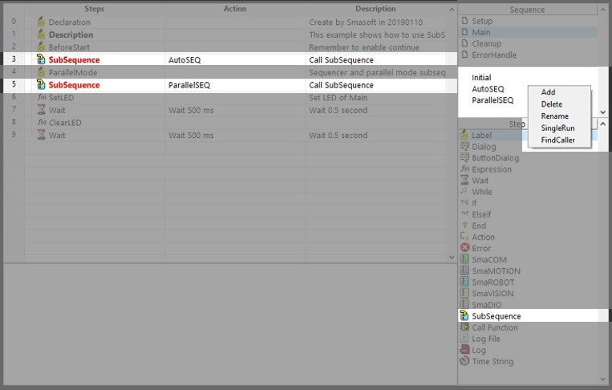
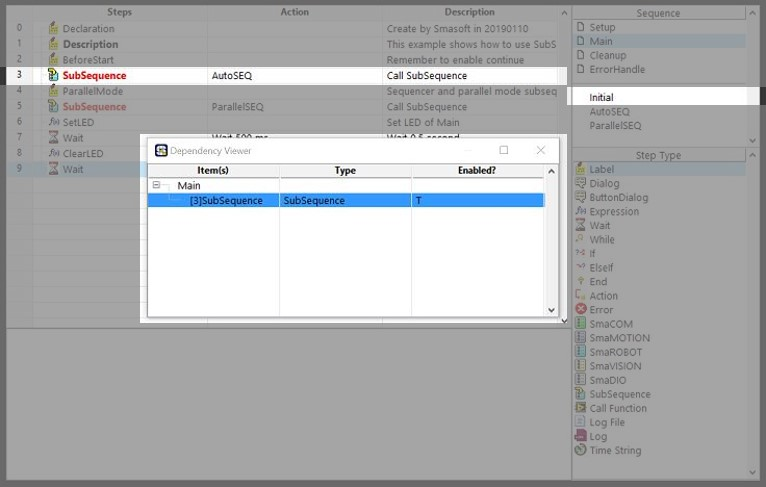

# 善用 Subsequence，讓主流程保持簡潔

當機台動作複雜、流程步驟眾多的情況下，將所有的程式都放在Main當中會變得難以閱讀和維護，此時可透過Subsequence\(副線程\)這個流程函式來改善這些問題。

首先，在Sequencer模組的操作介面上找到右側的副線程視窗，在視窗中點擊右鍵 -&gt; Add新增副線程，接著點選該副線程進行流程編寫，建議將為了達成某項特定動作的一連串流程步驟整合成一個副線程，或是在同一個時間點有複數動作要同時執行的情況下使用，流程編寫完成後，在流程大綱中的Setup或Main裡面找到想要呼叫副線程的地方加入Subsequence這個流程編輯函式，最後設定函式的參數即可，Subsequence函式的參數設定方式請參考\[[函數的功能與參數設定方式](../liu-cheng-han-shi/han-de-gong-neng-ding-fang-shi/)\]

在副線程視窗中按下右鍵可以進行以下操作 :

* 新增副線程\(Add\)
* 刪除副線程\(Delete\)
* 重新命名副線程\(Rename\)
* 單次運行此副線程\(Single Run\)
* 尋找調用到此副線程的位置\(Find Caller\)

有關呼叫子流程與指定運作模式，將在**流程步驟函式庫**章節中說明。

