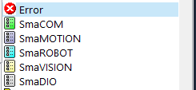
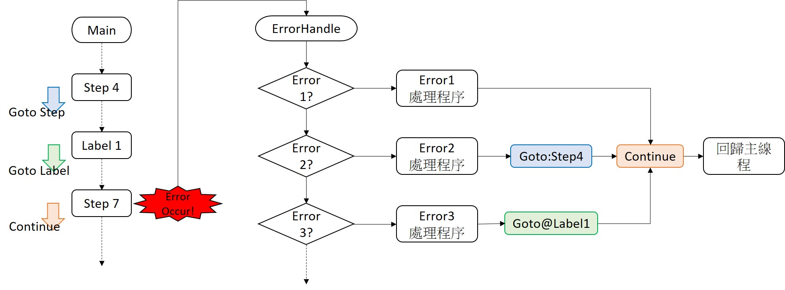
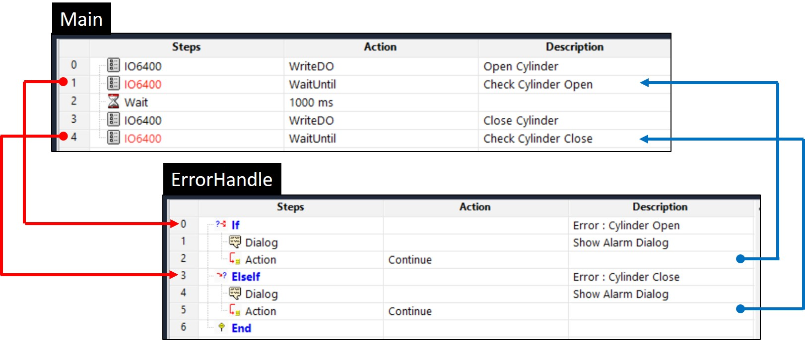

# 在 ErrorHandle 編輯專案的錯誤處理流程

#### SmaSEQ 提供 ErrorHandle\(錯誤處理\)功能，讓使用者可根據錯誤的條件，進行客製化的流程編排。

## 流程的錯誤處理機制

### 基本要點

* SmaSEQ 流程運行中出現錯誤時，**主流程、子流程都會進到暫停狀態**。同時間，ErrorHandle 流程會被喚醒並執行一次。
* 進入錯誤處理程序的方式有2種。
  * 模組步驟函式產生的運行錯誤，如：相機連線異常、手臂等待移動完成超時、通訊連線異常等。
  * 使用**【Error】**步驟函式直接產生自定義的錯誤條件。

### \# Step 1 : 在一般流程步驟中，以名稱定義錯誤類別

每個可產生錯誤的步驟，都有一個 Error Action 欄位，使用者可在欄位中給予錯誤名稱。當流程進行該步驟並產生錯誤時，系統會將此錯誤名稱記錄到**〔Error.Action〕**這個**字串變數**中。

### \# Step 2 :在錯誤處理流程中，以名稱判斷錯誤類別

ErrorHandle 流程中，請使用**【If】...【ElseIf】...【End】**架構，以〔Error.Action〕字串變數為判斷條件，分別進行各項錯誤處理的流程編排。判斷式的語法為 _**`Error.Action=="錯誤名稱"`**_。

### \# Step 3 : 解除暫停狀態

ErrorHandle 執行完畢後，若要流程恢復運行，方式有二：

* **人工解除暫停：**在專案控制面板上，將已是開啟狀態的 "Pause" 按鈕關閉，流程及繼續運行。
* **自動解除暫停：**ErrorHandle 流程中末端可使用**錯誤處理專用的【Action】**步驟，選擇 **&lt; Continue &gt;** 方法，即會在 ErrorHandle 執行完畢後，自動讓流程恢復運行狀態。

下方示意圖展示了不同的重啟方式。

* 直接使用 **【Action】**的 **&lt; Continue &gt;** 解除暫停，則流程會從暫停的步驟開始繼續運行。\(橘\)
* 先使用**【Action】**的 **&lt; Goto &gt;** ，指定某流程的某**步驟作為起始**，再用 **&lt; Continue &gt;** 解除暫停。\(藍橘\)
* 先使用**【Action】**的 **&lt; Goto &gt;** ，指定某流程的某**標籤作為起始**，再用 **&lt; Continue &gt;** 解除暫停。\(綠橘\)

**【Action】**步驟函式是專門提供給錯誤處理流程使用，可用的方法如下：

* Continue : 從暫停的狀態繼續運行 
* Pause : 暫停流程
* Goto : 繼續運行時，指定特定流程的起始步驟
* Cleanup : 直接進入Cleanup流程
* Abort : 強制關閉所有流程

有關**【Action】**步驟函式的詳細說明，請參閱《進階步驟函式》。

## 錯誤處理範例說明

### 1.\) DI 狀態等待超時 - 以汽缸動作未到位為例

#### 情境

以 DO 控制汽缸動作後，等待感測器 DI 訊號。若感測器遲遲未有反應，此時我們即可針對此超時錯誤設定處理機制。

#### 主流程

Main 流程中，分別針對汽缸開、汽缸關的動作使用**【SmaDIO】**的 **&lt; WaitUntil &gt;** 偵測汽缸訊號是否到位，若否，則會觸發 **&lt; WaitUntil &gt;** 方法的**超時錯誤**並進入 ErrorHandle 流程 。

#### 錯誤處理流程

ErrorHandle 中，以 **【If】...【ElseIf】...【End】**的結構分別判斷〔Error.Action〕字串內容，藉此決定要進入哪個條件下的錯誤處理流程，進行**【Dialog】**與**【Action】**。

### 2.\) 自定義的異常 -  SmaCOM 收取資料內容多次錯誤為例

#### 情境

假設已知的正確字串為 "ABCD"，使用**【SmaCOM】** 連線條碼槍讀取條碼，判斷回傳資料是否吻合。

#### 主流程

先使用**【SmaCOM】**的 **&lt; Write &gt;** 方法，下達指令給掃碼槍，等待 300毫秒後，使用**【SmaCOM】**的 **&lt; Read &gt;** 方法讀取條碼，並以**【IF】...【End】**判斷資料內容是否跟已知字串 "ABCD" 相同，若否，則使用**【Error】**步驟直接進入 ErrorHandle 流程。

#### 錯誤處理流程

使用**【If】...【End】**判斷〔Error.Action〕字串內容，若符合，則再使用 **【Dialog】**與**【Action】。**

### 3.\) DI 等待超時計數 - 以機械手臂吸取料件失敗為例

#### 情境

使用機械手臂的吸嘴進行取料時，透過真空感測器判斷是否有正常吸取。若吸取失敗則重新嘗試，超過三次便讓手臂回到原點、跳出警告視窗，待人員排除後關閉對話框，再重新進行嘗試流程。

#### 主流程

以**【SmaROBOT】**的 **&lt; WriteDO &gt;** 下達手臂吸料指令，並以**【SmaROBOT】**的 **&lt; WatiUntil &gt;** 等待 DI 訊號。若超過指定的時間而 DI 訊號仍未正確，則會觸發 **&lt; WaitUntil &gt; 超時錯誤**，進入 ErrorHandle流程。

#### 錯誤處理流程

先使用**【IF】...【End】**進行〔Error.Action〕判斷。若錯誤字串符合，使用**【SmaROBOT】**的 **&lt; WriteDO &gt;** 方法關閉吸嘴，並用**【Expression】**將數值變數 +1 進行計數。接著再以**【If】...【ElseIf】...【End】**條件判斷計數值。若計數小於 3 ，選擇使用**【Action】**回到指定的 Main 步驟重新嘗試，若大於 3，則使用**【Expression】**將計數歸零、**【SmaROBOT】**將手臂回到原點，再搭配**【Dialog】**、**【Action】**等。

有關各項步驟函式的使用方式，請參閱《步驟函式的功能與設定》相關內容。

