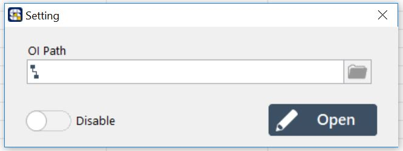

# OI - 設計您的操作員介面

有時候機台在運作時，希望有一個簡單易懂的操作員介面\(Operation Interface，OI\)讓人員來確認機台的運轉狀況或是設備控制，SmaSEQ 2.0提供您能夠自行設計操作員介面的功能。

首先，點選主畫面上方的Setting標籤會開啟OI的載入視窗，其中 :

* 建立新的OI : 直接按下視窗右下角的Open可以開啟一個新的空白OI。
* 載入原有OI : 按下OI Path欄位右側的瀏覽標籤後，可載入已經存在的OI。
* OI顯示與否 : 視窗左下角的Enable/Disable旗標用於決定在線程開始後是否要顯示OI，在開啟狀態下運作線程的話會自動跳出OI，否則OI不會出現。

